<div align="center">
  <h1>Novel Studio</h1>
  <p><strong>面向中文长篇小说的 AI 写作多智能体系统</strong></p>
  <p>一个命令，自动编排 8 个 Agent 完成从大纲到成稿的完整流水线</p>
  <p>
    
    
    
  </p>
</div>

---

## 为什么选择 Novel Studio

用 AI 写长篇小说最痛苦的不是文笔，是**失控**。

写到第 50 章忘了第 3 章埋的伏笔，角色性格悄然漂移，信息释放节奏混乱，上下文越写越长直到模型崩溃。Novel Studio 把这套复杂度拆成 **8 个各司其职的 Agent**，每个 Agent 只看到任务所需的最小上下文，通过状态机自动流转。

> 你表达意图，系统自动流转。中间不需要人工干预。

## 快速安装

```bash
claude plugin marketplace add deathwhispers/novel-studio
claude plugin install novel-studio@novel-studio
```

## 一条命令写完一章

```bash
/novel-studio:write 10
```

从确认方向 → 故事合约 → 场景五拍 → 正文起草 → 五重质量检查 → 状态更新，全自动流转：

```
  ✍️  确认第 10 章方向        →  推进（主角首次使用新能力），章尾钩子就位
  🎬  设计 3 个场景结构        →  钩子 → 主体冲突 → 收束，因果链闭合
  📝  连续起草 2800 字         →  场景边界 4 项硬门禁全部通过
  🔍  5-Checker 质量验收       →  AI 味 2 处已修复，无硬伤
  📋  状态更新 + 记忆压缩       →  第 10 章完结，就绪 /novel-studio:write 11
```

## 命令一览

| 命令 | 用途 |
|:------|:------|
| `/novel-studio:init` | 初始化新项目 — 多轮对话：品类、主角、篇幅、模式 |
| `/novel-studio:world` | 世界观构建 — 创建角色、完善力量体系、扩展设定 |
| `/novel-studio:write <N>` | 写章节 — Director → ScenePlanner → Writer → Critic → StateManager |
| `/novel-studio:check <N>` | 只读质量扫描 — 5 Checker 并行检查，不修改正文 |
| `/novel-studio:revise <N>` | 修订章节 — 自动选择最优修复路径，最小改动 |
| `/novel-studio:migrate <path>` | 存量导入 — 已有章节逆向提取为结构化状态文件 |

## 架构：Agent 流水线

```mermaid
flowchart LR
    classDef entry fill:#4f46e5,stroke:#3730a3,color:#fff,stroke-width:2px
    classDef plan fill:#0ea5e9,stroke:#0284c7,color:#fff,stroke-width:2px
    classDef draft fill:#8b5cf6,stroke:#7c3aed,color:#fff,stroke-width:2px
    classDef review fill:#f59e0b,stroke:#d97706,color:#fff,stroke-width:2px
    classDef persist fill:#10b981,stroke:#059669,color:#fff,stroke-width:2px
    classDef done fill:#6b7280,stroke:#4b5563,color:#fff,stroke-width:2px

    User(["👤 用户指令"]):::entry

    User -->|"write N"| Orch["🎯 Orchestrator<br/>意图识别 + 信息裁剪"]:::entry

    Orch -->|"DirectorBrief ~2.5K"| Dir["📋 Director<br/>Story Contract<br/>信息释放策略"]:::plan
    Dir -->|"ScenePlannerBrief ~1.5K"| SP["🎬 ScenePlanner<br/>场景五拍骨架<br/>因果链设计"]:::plan
    SP -->|"WriterBrief ~1.5K"| W["✍️ Writer<br/>正文起草<br/>4 项硬门禁"]:::draft
    W -->|"CriticBrief ~1K"| C["🔍 Critic<br/>5 Checker<br/>质量门禁"]:::review

    C -->|"通过"| SM["📋 StateManager<br/>状态更新<br/>记忆压缩"]:::persist
    C -.->|"局部修复"| W
    C -.->|"骨架失效"| SP

    SM --> Done(["✅ 完成"]):::done
```



## 8 个 Agent

每个 Agent 只掌握自己职责范围内的信息，通过 Orchestrator 裁剪的**交接包**通信。

| Agent | 职责 | 所有权 | 关键约束 |
|:-------|:------|:--------|:----------|
| **Orchestrator** | 入口、意图识别、信息裁剪 | `progress.yaml`, `agent-log` | 不创作、不检查、不修改状态 |
| **Architect** | Canon 唯一所有者 | `core/`, `setting/` | 不读正文、不写大纲 |
| **Archivist** | 正文逆向归档（仅迁移） | 迁移期间临时分析 | 不编造正文中没有的信息 |
| **Director** | 信息释放策略 + Story Contract | `outline/` | 不读正文、不写正文 |
| **ScenePlanner** | 场景五拍骨架设计 | 场景节拍 | 不写正文、不决定信息释放 |
| **Writer** | 正文唯一执行者 | `chapters/` | 不知道第 50 章的反转 |
| **Critic** | 5 Checker 质量门禁 | 质量报告 | 不修改正文 |
| **StateManager** | 状态更新 + 记忆压缩 | `state/`（唯一写入口） | Critic 未通过不执行 |

## 渐进式披露：信息裁剪

Orchestrator 不仅是路由器，更是**信息经纪人**——从上游完整输出中裁剪出下游真正需要的字段。累计上下文预算从 ~34K 降至 ~25K。

| 交接包 | 接收方 | 大小 | 核心内容 |
|:--------|:--------|:-----|:----------|
| DirectorBrief | Director | ~2.5K | 状态摘要 + 卷纲 + 硬设定 |
| ScenePlannerBrief | ScenePlanner | ~1.5K | Story Contract 全文 + POV 角色摘要 |
| WriterBrief | Writer | ~1.5K | 五拍骨架 + 禁止触碰清单 + 章尾落点 |
| CriticBrief | Critic | ~1K | 合并检查清单（forbid + canon + pov） |
| StateManagerBrief | StateManager | ~0.5K | Review Report + state_delta |

## 工作区结构

```
my-novel/
├── core/                    作品总表
├── setting/                 角色档案、世界规则、力量体系
├── outline/                 全书总纲、分卷大纲
├── chapters/                已完成章节正文
├── snippets/                灵感片段、废弃草稿
└── state/                   运行时状态（系统自动维护）
    ├── author.yaml          作者秘密、伏笔计划、备忘
    ├── reader.yaml          读者已知事实、猜测、待解答问题
    ├── character.yaml       角色位置、状态、关系、压力项
    ├── foreshadow.yaml      伏笔追踪（埋设 → 触碰 → 揭示 → 归档）
    ├── progress.yaml        写作进度（当前章、总字数、章节状态）
    └── agent-log.yaml       Agent 运行日志（支持断点恢复）
```

## 5 大关键设计

| # | 设计 | 说明 |
|:--|:-----|:-----|
| 1 | **Agent 不自选后继** | 下一步永远由状态机决定：NEED_PLAN → NEED_SCENE → NEED_DRAFT → NEED_REVIEW → COMPLETED |
| 2 | **StateManager 唯一写入口** | 其他 Agent 只标记 `state_delta` 增量，不直接写 `state/` |
| 3 | **Writer 不读大纲** | 只知道 Scene Contract 的允许与禁止，不知道第 50 章的反转 |
| 4 | **Critic 最后一道门禁** | 5 Checker（逻辑/信息泄漏/人物/节奏/文风）全部通过才更新状态 |
| 5 | **修复回路精准回退** | 局部修复 → Writer · 骨架失效 → ScenePlanner · 大面积泄漏 → Director |

## 许可

Apache-2.0 © 2025 deathwhispers
