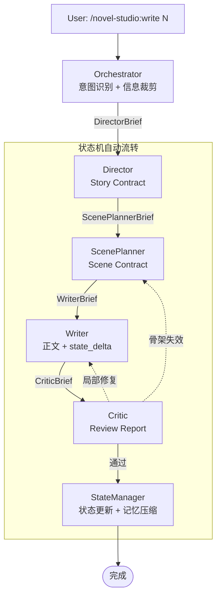

<p align="center">
  <h1 align="center">Novel Studio</h1>
  <p align="center">
    <b>面向中文长篇小说的 AI 写作多智能体系统</b>
    <br/>
    一个命令，自动编排 8 个 Agent 完成从大纲到成稿的完整流水线
  </p>
</p>

<p align="center">
  
  
  
</p>

---

## 为什么选择 Novel Studio

用 AI 写长篇小说最痛苦的不是文笔——是**失控**。

写到第 50 章忘了第 3 章埋的伏笔、角色性格悄然漂移、信息释放节奏混乱、上下文越写越长直到模型崩溃。  
Novel Studio 把这套复杂度拆成 **8 个各司其职的 Agent**，每个 Agent 只看到任务所需的最小上下文，通过状态机自动流转。

> **你表达意图，系统自动流转。中间不需要人工干预。**

## 快速安装

```bash
claude plugin marketplace add deathwhispers/novel-studio
claude plugin install novel-studio@novel-studio
```

## 一条命令写完一章

```bash
/novel-studio:write 10
```

从确认方向 → 故事合约 → 场景五拍 → 正文起草 → 五重质量检查 → 状态更新，**全自动流转**：

```
✍️ 正在确认第 10 章方向…
   ✅ 本章功能：推进（主角首次使用新能力）
   章尾钩子：系统弹出前所未有的任务类型

🎬 正在设计场景结构…
   ✅ 3 个场景已编排（钩子 → 主体冲突 → 收束）

📝 正在写作中…
   ✅ 第 10 章完成（2800 字）

🔍 正在质量检查…
   ✅ 通过（AI 味 2 处已修复，无硬伤）

📋 状态已更新 → 第 10 章完结
```

## 命令一览

| 命令 | 用途 |
|------|------|
| `/novel-studio:init` | 初始化新项目 — 多轮对话确定品类、主角、篇幅、模式 |
| `/novel-studio:world` | 世界观构建 — 添加角色、完善力量体系、扩展设定 |
| `/novel-studio:write <N>` | 写章节 — Director → ScenePlanner → Writer → Critic → StateManager |
| `/novel-studio:check <N>` | 只读质量检查 — 5 个 Checker 扫描，不修改正文 |
| `/novel-studio:revise <N>` | 修订章节 — 自动选择最优修复路径 |
| `/novel-studio:migrate <path>` | 存量项目导入 — 已有章节逆向提取为结构化状态 |

## 架构：Agent 流水线



## 8 个 Agent

每个 Agent 只掌握自己职责范围内的信息，通过 Orchestrator 裁剪的**交接包**通信。

| Agent | 职责 | 所有权 | 关键约束 |
|-------|------|--------|----------|
| **Orchestrator** | 入口 + 意图识别 + 信息裁剪 | progress.yaml, agent-log | 不创作、不检查、不修改状态 |
| **Architect** | Canon 唯一所有者 | core/, setting/ | 不读正文、不写大纲 |
| **Archivist** | 正文逆向归档（仅迁移） | 迁移期间的临时分析 | 不编造正文中没有的信息 |
| **Director** | 信息释放策略 + Story Contract | outline/ | 不读正文、不写正文 |
| **ScenePlanner** | 场景五拍骨架设计 | 场景节拍 | 不写正文、不决定信息释放 |
| **Writer** | 正文唯一执行者 | chapters/ | 不知道第 50 章的反转 |
| **Critic** | 5 Checker 质量门禁 | 质量报告 | 不修改正文 |
| **StateManager** | 状态更新 + 记忆压缩 | state/（唯一写入口） | Critic 未通过不执行 |

### 渐进式披露：信息裁剪

每个 Agent 不是直接加载文件，而是接收 Orchestrator 裁剪后的专属 Brief。累计上下文预算从 ~34K 降至 ~25K。

| 交接包 | 接收方 | 预估大小 | 核心内容 |
|--------|--------|----------|----------|
| DirectorBrief | Director | ~2.5K | 状态摘要 + 卷纲 + 硬设定 |
| ScenePlannerBrief | ScenePlanner | ~1.5K | 完整 Story Contract + POV 角色摘要 |
| WriterBrief | Writer | ~1.5K | 五拍骨架 + 约束 + 章尾落点 |
| CriticBrief | Critic | ~1K | 合并检查清单（forbid + canon + pov） |
| StateManagerBrief | StateManager | ~0.5K | Review Report + state_delta |

## 工作区结构

一个典型项目的工作目录：

```
my-novel/
├── core/                    # 作品总表
├── setting/                 # 角色、世界、力量体系
├── outline/                 # 全书总纲 + 分卷大纲
├── chapters/                # 已完成的章节正文
├── snippets/                # 灵感片段
└── state/                   # 运行时状态（系统维护）
    ├── author.yaml          # 秘密、计划、备忘
    ├── reader.yaml          # 读者已知/猜测/疑问
    ├── character.yaml       # 角色认知状态
    ├── foreshadow.yaml      # 伏笔追踪
    ├── progress.yaml        # 写作进度
    └── agent-log.yaml       # Agent 运行日志
```

## 5 大关键设计

> **Agent 不自选后继。** 下一步永远由状态机决定：NEED_PLAN → NEED_SCENE → NEED_DRAFT → NEED_REVIEW → COMPLETED。

> **StateManager 是唯一写入口。** 其他 Agent 只标记增量（state_delta），不直接写 `state/`。

> **Writer 不知道第 50 章的反转。** 只知道 Scene Contract 说了「可以写 X，禁止碰 Y」，避免无意识剧透。

> **Critic 是最后一道门禁。** 5 个 Checker（逻辑 / 信息泄漏 / 人物 / 节奏 / 文风），全部通过后才更新状态。

> **修复回路精准回退。** 局部修复 → 回 Writer；骨架失效 → 回 ScenePlanner；大面积信息泄漏 → 回 Director。

## 许可

[Apache-2.0](LICENSE)
