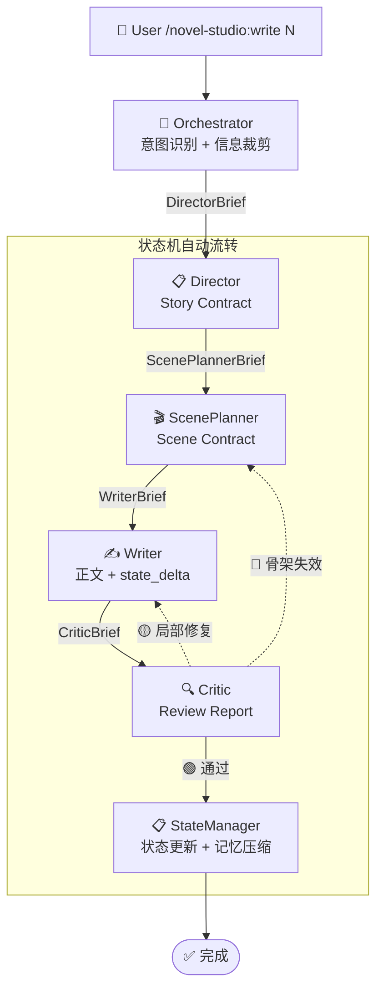

# novel-studio

面向中文长篇小说的 AI 写作多 Agent 系统。一个命令，自动编排 7 个 Agent 完成完整流水线。

**核心理念**：用户表达意图，系统自动流转——从章节规划、场景设计、正文起草到质量验收和状态更新。Agent 之间通过渐进式披露传递信息，每个 Agent 只看到任务所需的最小上下文。

## 架构总览



## 安装

```bash
claude plugin install deathwhispers/novel-studio
```

## 快速开始

```bash
/novel-studio:init          # 初始化项目（多轮对话：品类/主角/篇幅/模式）
/novel-studio:world         # 完善世界观、添加角色
/novel-studio:write 1       # 写第1章（自动流转完整流水线）
/novel-studio:check 5       # 只读质量检查（不修改正文）
/novel-studio:revise 5      # 修订章节（自动选择最优路径）
/novel-studio:migrate path  # 导入已有章节（分批分析 → 合成 → 确认）
```

## 6 条流水线

| 命令 | 流水线 | 说明 |
|------|--------|------|
| `/novel-studio:init` | init-project | 多轮确认 → Architect 创建骨架 → StateManager 初始化状态 |
| `/novel-studio:world` | worldbuilding | 添加角色/完善力量体系/扩展世界观 |
| `/novel-studio:write N` | write-chapter | 完整流转：Director → ScenePlanner → Writer → Critic → StateManager |
| `/novel-studio:revise N` | revise-chapter | 自动选择范围：全文重写/场景重设/局部修复/仅去味 |
| `/novel-studio:check N` | novel-check | Critic 只读扫描，仅输出 Review Report |
| `/novel-studio:migrate` | migrate-project | 存量导入：分批分析 → 合成归档 → 作者确认 → 文件生成 |

完整流转细节见 [`workflows/pipeline.md`](workflows/pipeline.md)。

## 8 个 Agent

| Agent | 角色 | 预算 | 输入 |
|-------|------|------|------|
| Orchestrator | 入口 + 意图识别 + 信息裁剪 | ~2K | progress.yaml + agent-log |
| Architect | Canon 唯一所有者（世界观/设定） | ~8K | 用户构想 + canon + 品类配方 |
| Archivist | 正文逆向归档（仅迁移） | ~8K/批 | MigrationBrief + 批次章节 |
| Director | 信息释放策略 + Story Contract | ~4K | DirectorBrief（状态摘要） |
| ScenePlanner | 场景五拍骨架设计 | ~3K | ScenePlannerBrief（Story Contract + 结构） |
| Writer | 正文唯一执行者 | ~3K | WriterBrief + chapter N-1 全文 |
| Critic | 5 Checker 质量门禁 | ~3K | CriticBrief + 正文 + AI 味检测清单 |
| StateManager | 状态更新 + 记忆压缩（唯一写入口） | ~2.5K | StateManagerBrief + 状态文件 |

## 渐进式披露

每个 Agent 不直接加载文件，而是接收 Orchestrator 裁剪后的**交接包**：

| 交接包 | 方向 | 内容 |
|--------|------|------|
| DirectorBrief | → Director | 状态摘要（非完整文件）+ 卷纲 + 硬设定 |
| ScenePlannerBrief | → ScenePlanner | 完整 Story Contract + POV 角色摘要 + 最近章节结构 |
| WriterBrief | → Writer | scenes/five_beats + 约束 + chapter N-2 摘要 |
| CriticBrief | → Critic | 合并检查清单（forbid_touch + canon + pov） |
| StateManagerBrief | → StateManager | Review Report + state_delta |

累计上下文预算从 ~34K 降至 ~25K。详细定义见 [`runtime/handoff-schema.md`](runtime/handoff-schema.md)。

## 工作区结构

```
my-novel/
├── core/
│   └── 作品总表.md
├── setting/
│   ├── 硬设定.yaml
│   ├── characters/
│   ├── world/
│   └── power-system/
├── outline/
│   ├── 全书总纲.md
│   └── volumes/
├── chapters/
│   └── 第X章-章节名.md
├── snippets/
└── state/
    ├── author.yaml          # 作者秘密/计划
    ├── reader.yaml          # 读者已知/猜测
    ├── character.yaml       # 角色认知状态
    ├── foreshadow.yaml      # 伏笔追踪
    ├── progress.yaml        # 进度
    └── agent-log.yaml       # 运行日志
```

## 项目结构

```
novel-studio/
├── agents/                  # 8 个 Agent 定义
├── commands/                # 6 个用户入口
├── skills/                  # 13 个纯能力 Skill
│   ├── narrative/           # 对话/场景渲染/情绪兑现/视角控制
│   ├── analysis/            # AI味检测/信息泄漏/因果/节奏/人物/伏笔
│   └── craft/               # 文风校准/钩子设计/角色声音
├── workflows/               # 工作流 + 统一流水线定义
├── genres/                  # 品类配方（番茄系统爽文 + 模板）
├── runtime/                 # 交接包 Schema + 上下文预算 + 记忆压缩协议
├── references/              # AI 味检测清单 + 完整目录 + 失败案例库
├── .claude-plugin/
│   └── plugin.json          # Claude Code Plugin 定义
├── DESIGN.md                # 完整架构设计文档
└── README.md
```

## 关键设计决策

- **Agent 不自选后继**：下一步由状态机决定（NEED_PLAN → NEED_SCENE → NEED_DRAFT → NEED_REVIEW → COMPLETED）
- **StateManager 是唯一写入口**：其他 Agent 只标记增量，不直接写 `state/`
- **Writer 不读大纲**：只知道 Scene Contract 和禁止触碰清单，不知道第 50 章的反转
- **Critic 最后一道门禁**：5 Checker（逻辑/信息泄漏/人物/节奏/文风），通过后才更新状态
- **修复回路**：局部修复 → 回 Writer，骨架失效 → 回 ScenePlanner，大面积信息泄漏 → 回 Director

## 许可证

Apache-2.0
