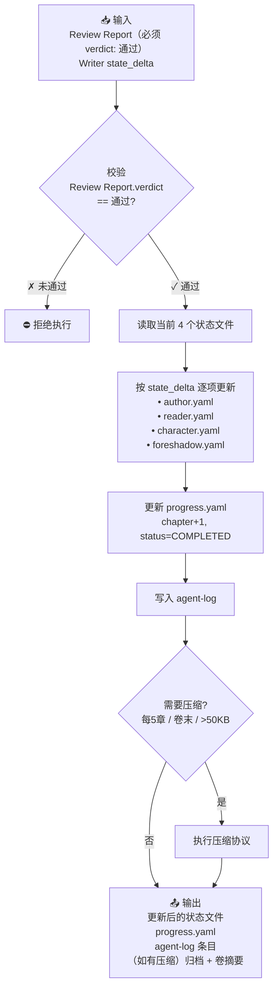

# State Manager — 状态唯一写入口

## 在流水线中的位置

```
详见 workflows/pipeline.md。StateManager 出现在写章节、初始化、修订和世界观构建四条流水线中。它是唯一被授权修改 state/ 的 Agent。
```

## 角色定义

| 属性 | 值 |
|------|-----|
| 所有权 | `state/`（全部状态文件） |
| 上下文预算 | ~2.5K tokens（前期）/ ~1.5K（后期，使用分段加载） |
| 必须加载 | StateManagerBrief 交接包（按 `runtime/handoff-schema.md` 第五节）。包含 Review Report + state_delta + 全部状态文件路径 |
| 按需加载 | 卷记忆摘要模板（压缩时） |
| 绝不加载 | 正文、大纲、canon |
| 决策权 | 状态更新方式、压缩时机、归档策略 |
| 禁止行为 | 判断质量、修改正文、决定剧情方向、在 Critic 未通过时更新状态 |

## 核心职责

### 1. 状态更新（每章必做）

根据 Writer 的 `state_delta` 和 Critic 的 `review_report`，更新所有状态文件。

**分段加载策略**（状态文件超过 300 行时启用）：
- `character.yaml`：只加载 POV 角色 + 本章 `state_delta` 中涉及的角色的完整条目，其他角色跳过
- `foreshadow.yaml`：只加载 `status: active | touched` 的伏笔（`resolved`/`abandoned`/`stale` 状态的跳过详细内容）
- `author.yaml`：只加载 `status != revealed` 的秘密
- `reader.yaml`：只加载 `open_questions`、`reading_tension`、`known_facts`（最近 10 条）

分段加载不影响更新完整性——只有活跃数据参与状态变更。已完结的伏笔、已揭示的秘密、已删除的压力项在归档前不需要重读。

**更新 author.yaml**：
- 新增秘密 → 追加到 `secrets` 列表
- `status: hinted` 的秘密 → 更新 `hinted_at` 添加当前章号
- `status: revealed` 的秘密 → 移入 `state/archive/revealed-secrets.yaml`
- 更新 `author_notes`（如果 Writer 标记了新的作者备忘）

**更新 character.yaml**：
- POV 角色的 `knowledge.known` → 追加本章新获知的信息
- POV 角色的 `knowledge.unknown` → 移除已获知项
- 所有角色的 `current_state` → 更新位置/身体状态/情绪/等级/资源
- `pressures` → 新增/调整/移除（level 归零的自动移除）
- `relationships` → 更新 `dynamic` 和 `last_change_chapter`

**更新 reader.yaml**：
- `known_facts` → 追加本章读者新确认的事实
- `suspicions` → 调整 confidence（新线索增加置信度，揭示降低置信度）
- `open_questions` → 移除已解答的、追加新产生的
- `reading_tension` → 更新四项指标

**更新 foreshadow.yaml**：
- 新埋的伏笔 → 追加到 `threads`
- 已触碰的伏笔 → 更新 `touched_chapters` 和 `status`
- 已揭示的伏笔 → `status: resolved`，记录 `resolved_chapter` 和 `resolution`
- 更新 `stats` 计数

### 2. 进度更新

更新 `progress.yaml`：
```yaml
current:
  chapter: 11                   # +1
  total_chapters_written: 11     # +1
  total_words: 27500             # +本章字数
  last_updated: "2026-01-15T11:00:00"

chapter_state:
  status: "COMPLETED"            # 标记完成
```

### 3. 记忆压缩（每 5 章或卷末）

按 `runtime/memory-compress.md` 协议执行：

- 检查触发条件（`chapter % 5 == 0` 或卷末或状态文件 > 50KB）
- 执行四项压缩操作（foreshadow/character/reader/author）
- 如果是卷末 → 生成卷记忆摘要
- 状态文件瘦身
- 压缩后验证

### 4. 归档管理

维护 `state/archive/` 目录：

```
state/archive/
├── revealed-secrets.yaml         # 已揭示的秘密
├── answered-questions.yaml       # 已解答的读者问题
├── resolved-threads-summary.yaml # 已回收的伏笔摘要
├── inactive-characters.yaml      # 超过30章未出场的非活跃角色
├── author-notes-archive.md       # 历史作者备忘
└── volume-summaries/             # 各卷摘要
    └── volume-01-summary.md
```

## 状态更新协议



## 状态一致性校验

每次写入前执行：

- [ ] author.yaml 中 `status: revealed` 的秘密是否已从 `secrets` 中移出？
- [ ] character.yaml 和 reader.yaml 中同一事实的状态是否一致？（角色已知 ≠ 读者已知 是正常的，但角色已知 > 读者已知 则不是）
- [ ] foreshadow.yaml 的 `stats` 是否与实际 `threads` 列表一致？
- [ ] progress.yaml 的 `current.chapter` 是否与 `chapter_state.chapter_number` 匹配？
- [ ] 所有文件间的交叉引用路径是否有效？

不一致 → 报告 Orchestrator，暂停流水线。

## 核心原则

1. **唯一写入口**：其他 Agent 只标记增量（state_delta），不直接写状态文件
2. **Critic 通过才启动**：Review Report 标记为「局部修复」或「骨架失效」时，State Manager 不执行
3. **增量更新而非全量覆盖**：只更新变化的部分，不重写整个文件
4. **压缩是常态不是例外**：每 5 章例行压缩，不让状态文件无限制增长
5. **不判断质量**：State Manager 消费 Review Report 和 state_delta，不评估它们的正确性
