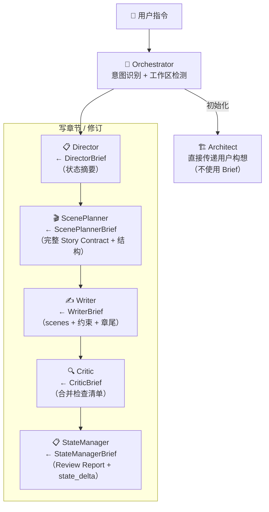

# 交接包格式定义

> 定义每种 Agent 从 Orchestrator 收到的交接包格式。Orchestrator 负责从上游完整输出中裁剪出下游需要的字段，实现渐进式披露。

---

## 一、DirectorBrief

**方向**：Orchestrator → Director
**预估**：~2.5K tokens
**用途**：Director 据此生成 Story Contract。不直接加载完整状态文件。

```yaml
director_brief:
  from: Orchestrator
  to: Director

  # 用户意图
  user_intent: "写第11章，推进主线——主角首次使用新能力"
  chapter_number: 11
  genre: "番茄系统爽文"

  # 状态摘要（由 Orchestrator 从状态文件中提取，非完整文件）
  state_summary:
    secrets:                          # 从 author.yaml 提取，仅 status != revealed
      - id: "sec-001"
        title: "系统的真正来源"
        planned_reveal_chapter: 50
      - id: "sec-002"
        title: "神秘配角的真实身份"
        planned_reveal_chapter: 35

    open_questions:                   # 从 reader.yaml 提取，最近 5 条
      - "系统对主角的评价标准是什么？"
      - "被救者为什么认识主角？"

    reading_tension:                  # 从 reader.yaml 提取，仅数值
      main_plot_progress: 70
      suspense_pressure: 65
      satisfaction_pending: 3         # 距离上次爽点的章数

    pov_characters:                   # 从 character.yaml 提取，仅 POV 角色
      - id: "char-001"
        name: "主角"
        knowledge:
          unknown:                    # 角色尚不知道的信息
            - "系统的真正来源"
            - "神秘配角的身份"
        constraints:
          cannot_do: ["暴露系统存在"]
          cannot_know: ["系统的真正目的"]

    active_threads:                   # 从 foreshadow.yaml 提取，仅 status=active
      - id: "thr-001"
        content: "玉佩在关键时刻发烫"
        priority: "high"
        last_touched_chapter: 8
      - id: "thr-003"
        content: "某角色每次提到某个话题就转移视线"
        priority: "medium"
        last_touched_chapter: 5

  # 必读文件路径
  must_read:
    volume_outline: "outline/volumes/volume-01-outline.md"
    hard_canon: "setting/硬设定.yaml"
    genre_rhythm: "genres/番茄系统爽文/rhythm.md"   # 如适用

  # 明确禁止加载
  must_not_read:
    - "chapters/ 下任何文件"
    - "state/ 下完整状态文件（摘要已在上方 state_summary 中）"
```

---

## 二、ScenePlannerBrief

**方向**：Orchestrator → ScenePlanner
**预估**：~1.5K tokens
**用途**：ScenePlanner 据此生成 Scene Contract。只加载 Story Contract 完整内容 + POV 角色摘要 + 最近章节结构。

```yaml
sceneplanner_brief:
  from: Orchestrator
  to: ScenePlanner

  # Director 产出的完整 Story Contract（ScenePlanner 需要全部字段）
  story_contract:
    chapter: 11
    chapter_function: "推进"
    function_detail: "主角首次使用新获得的能力解决实际问题"
    info_release:
      can_reveal:
        - "新能力的名称和基本效果"
        - "系统对主角完成新手阶段的评价"
      can_hint:
        - "新能力的真正代价开始显现"
      forbid_touch:
        - "系统的真正来源（sec-001）"
        - "神秘配角的真实身份（sec-002）"
    thread_touch:
      - id: "thr-001"
        action: "轻碰"
        detail: "玉佩在主角使用新能力时微微发烫"
    chapter_end_hook: "主角用新能力解决了眼前危机，但系统弹出了一个他从未见过的任务类型"
    reader_question: "这个新任务背后隐藏着什么？"
    must_preserve:
      - "主角对系统的态度：实用但不完全信任"
    must_avoid:
      - "AI 味：解释腔"
      - "信息泄漏：让读者自己推导玉佩和能力的关联"
    genre_constraints:
      must_have_satisfaction_point: true
      satisfaction_type: "能力兑现"

  # POV 角色摘要（从 character.yaml 提取，只需名字和当前状态）
  pov_character_brief:
    name: "主角"
    current_state:
      location: "XX城训练场"
      level: "炼气三层"
    speech_pattern: "简短/直接/不解释"
    mannerisms: "思考时摸下巴"

  # 最近 2 章结构（不含正文内容）
  recent_chapters_structure:
    - chapter: 9
      scene_count: 3
      word_count: 2400
      chapter_function: "揭示"
    - chapter: 10
      scene_count: 2
      word_count: 2100
      chapter_function: "高潮"

  # 明确禁止加载
  must_not_read:
    - "chapters/ 正文全文"
    - "outline/ 完整大纲"
    - "state/ 状态文件"
```

---

## 三、WriterBrief

**方向**：Orchestrator → Writer
**预估**：~1.5K tokens（交接包自身）+ 正文路径（Writer 自行读取）
**用途**：Writer 据此起草正文。不加载完整 Scene Contract——只拿到 scenes/five_beats/writer_constraints/chapter_end。

```yaml
writer_brief:
  from: Orchestrator
  to: Writer
  chapter: 11

  # 场景列表（从 Scene Contract 提取，仅 Writer 需要的字段）
  scenes:
    - id: 1
      function: "钩子——展示新能力的初次使用"
      pov: "主角"
      narrative_distance: "近"
      environment: "XX城训练场，清晨"
      environment_pressure: "系统任务时限只剩2小时"
      five_beats:
        goal: "在时限内完成系统指定的能力测试"
        obstacle: "测试内容远超主角当前水平"
        change: "主角放弃常规方式，利用能力的漏洞取巧"
        surprise: "系统给出「创造性使用」的评价"
        new_question: "系统到底是在测试能力，还是在测试思维方式？"

    - id: 2
      function: "主体——新任务展开，冲突升级"
      pov: "主角"
      narrative_distance: "近"
      environment: "XX城中心广场，人群密集"
      environment_pressure: "不能暴露系统"
      five_beats:
        goal: "在不引起注意的前提下完成新任务"
        obstacle: "任务目标是一个正在被追杀的人——救他会暴露自己"
        change: "主角选择救，但用伪装身份介入"
        surprise: "被救的人认出了主角的身份"
        new_question: "这个人是谁？为什么认识主角？"

    - id: 3
      function: "收束——章尾钩子"
      pov: "主角"
      narrative_distance: "近"
      environment: "废弃仓库，只有两人"
      environment_pressure: "被救者伤势严重，时间不多"
      five_beats:
        goal: "从被救者口中获取信息"
        obstacle: "被救者提出条件——先帮他完成一件事"
        change: "主角被迫接受条件，暗中留了后手"
        surprise: "被救者提到的地点，正是系统最早发布任务的地方"
        new_question: "系统和这个人的关联是什么？"

  # Writer 约束（直接从 Scene Contract 提取）
  writer_constraints:
    must_preserve:
      - "主角的伪装身份不能暴露给路人"
      - "被救者说话方式：急促/省略/用词古怪"
    must_avoid:
      - "AI 味：解释主角为什么选择取巧——让行动本身说明"
      - "信息泄漏：不能说「系统和这个人有关联」——只写他的行为暗示"

  # 章尾落点（从 Scene Contract 提取）
  chapter_end:
    hook: "主角接受了一个不知深浅的条件，而对方提到的地点让他意识到——系统从一开始就在布局"
    reader_question: "系统和这个神秘组织到底是什么关系？"

  # 需自行读取的文件
  must_read:
    last_two_chapters:           # Writer 自行读取正文全文（这是最大的 token 消耗项）
      - "chapters/第009章-章节名.md"
      - "chapters/第010章-章节名.md"
    voice_samples:               # Writer 自行读取
      - "snippets/主角-voice.md"

  # 明确禁止加载
  must_not_read:
    - "Scene Contract 完整文件（已在上方 scenes 中提取所需字段）"
    - "outline/ 任何文件"
    - "state/ 任何文件"
    - "setting/ 任何文件"
```

---

## 四、CriticBrief

**方向**：Orchestrator → Critic
**预估**：~1K tokens（交接包自身）+ 正文全文（Critic 自行读取）
**用途**：Critic 据此执行 5 个 Checker。不从多个文件拼凑——收到一份合并的检查清单。

```yaml
critic_brief:
  from: Orchestrator
  to: Critic
  chapter: 11

  # 需自行读取
  chapter_text: "chapters/第011章-章节名.md"
  ai_flavor_catalog: "references/ai-flavor-catalog.md"

  # 信息泄漏检查清单（从 Story Contract 提取）
  forbid_touch:
    - "系统的真正来源"
    - "神秘配角的真实身份"
    - "第50章的反转线索"

  # 硬设定检查清单（从 setting/硬设定.yaml 精简提取）
  hard_canon_checklist:
    - "系统只能由主角使用"
    - "系统任务不可拒绝，但完成方式可选"
    - "主角当前等级：炼气三层——不能使用超过炼气期的能力"

  # POV 角色约束（从 character.yaml 提取）
  pov_constraints:
    character: "主角"
    cannot_know:
      - "系统的真正来源"
      - "神秘配角的身份"
    cannot_do:
      - "暴露系统存在"

  # 品类禁忌（从 genre recipe 提取，如适用）
  genre_taboos:
    - "主角不能被动等待——必须主动出击"
    - "奖励必须有代价——不能无代价获得能力"

  # 明确禁止加载
  must_not_read:
    - "Scene Contract 完整文件"
    - "Story Contract 完整文件"
    - "state/ 完整状态文件"
    - "outline/ 任何文件"
    - "setting/ 完整设定文件"
```

---

## 五、StateManagerBrief

**方向**：Orchestrator → StateManager
**预估**：~0.5K tokens（交接包自身）+ 状态文件（StateManager 自行读取）
**用途**：StateManager 据此更新所有状态文件。唯一需要加载完整状态文件的 Agent。

```yaml
statemanager_brief:
  from: Orchestrator
  to: StateManager
  chapter: 11

  # Critic 产出的完整 Review Report
  review_report:
    chapter: 11
    verdict: "通过"

    checkers:
      logic:
        passed: true
        issues: []
      info_leak:
        passed: true
        issues: []
      character:
        passed: true
        issues: []
      pace:
        passed: true
        issues: []
      style:
        passed: true
        ai_flavor_total: 1

  # Writer 产出的完整 state_delta
  state_delta:
    character_changes:
      - character: "主角"
        level_progress: "+10%"
        new_ability_used: "新能力名称"
        pressure_change: "+20 (新能力代价开始显现)"
    secrets_touched: []
    threads_touched:
      - id: "thr-001"
        action: "玉佩发烫"
        chapter: 11
    new_threads_planted: []
    reader_knowledge_gained:
      - "新能力的基本效果"
      - "被救者认识主角"
    open_questions_answered: []
    open_questions_raised:
      - "系统和被救者有什么关联？"

  # 需自行读取（StateManager 是唯一全量加载状态文件的 Agent）
  must_read:
    - "state/author.yaml"
    - "state/reader.yaml"
    - "state/character.yaml"
    - "state/foreshadow.yaml"
    - "state/progress.yaml"

  # 明确禁止加载
  must_not_read:
    - "chapters/ 任何文件"
    - "outline/ 任何文件"
    - "setting/ 任何文件"
```

---

## 交接包流转总图



---

## 裁剪原则

Orchestrator 在准备交接包时遵守：

1. **下游不需要的字段一律移除**：上游完整输出中的内部细节（如 Scene Contract 的 `pace_check`、`transition_to_next`）不传递给 Writer
2. **合并而非分发**：Critic 需要 forbid_touch（来自 Story Contract）+ hard_canon（来自 setting）+ pov_constraints（来自 character）→ Orchestrator 合并为一份 CriticBrief，而不是让 Critic 读三份文件
3. **摘要而非全文**：Director 需要状态信息但不需要完整文件 → Orchestrator 从状态文件中提取摘要
4. **路径而非内容**：正文、voice 样本等大文件 → 传递文件路径，由目标 Agent 自行读取（避免 Orchestrator 上下文膨胀）
5. **禁止清单是硬约束**：每个 Brief 包含 `must_not_read`，明确禁止 Agent 自行加载额外文件
