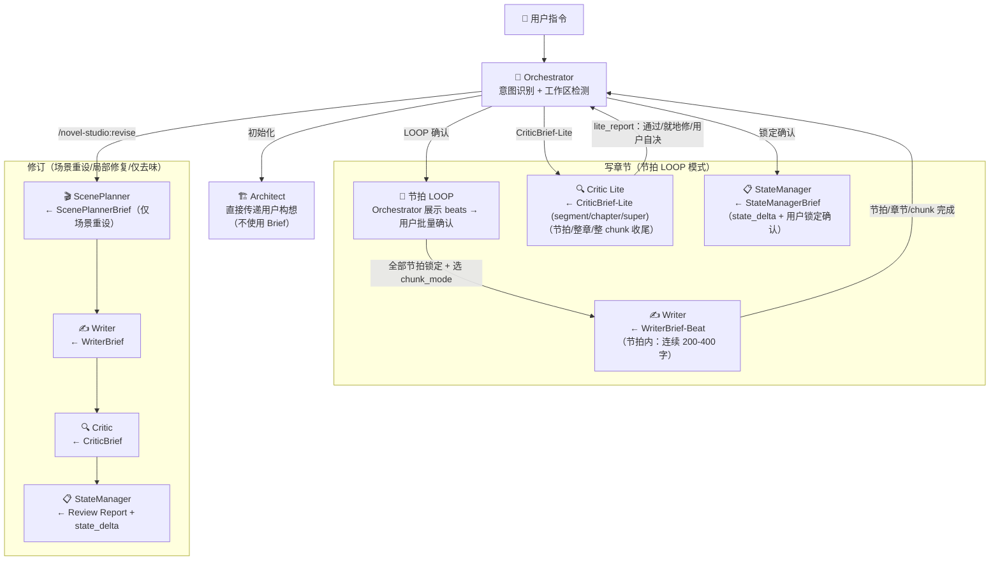

# 交接包格式定义

> 定义每种 Agent 从 Orchestrator 收到的交接包格式。Orchestrator 负责从上游完整输出中裁剪出下游需要的字段，实现渐进式披露。

---

## 一、ScenePlannerBrief

**方向**：Orchestrator → ScenePlanner
**预估**：~1.5K tokens
**用途**：ScenePlanner 据此重设计 Scene Contract。只加载修订目标 + 现有章节场景结构 + POV 角色摘要。

```yaml
sceneplanner_brief:
  from: Orchestrator
  to: ScenePlanner

  # 修订目标（用户要改什么）
  revision_target:
    chapter: 11
    scope: "场景重设"
    problem: "节奏不对——冲突升级太快，读者来不及紧张就已解决"
    keep: "本章核心功能（推进主线）不变，只改场景结构"

  # 现有章节场景结构（从当前正文提取）
  existing_scenes:
    - id: 1
      function: "钩子——展示新能力的初次使用"
      word_count: 950
      issue: "爽点兑现太快"
    - id: 2
      function: "主体——新任务展开，冲突升级"
      word_count: 800
      issue: "冲突升级太快，缺少加压过程"
    - id: 3
      function: "收束——章尾钩子"
      word_count: 500
      issue: null

  # 章尾意图（保持本章原有落点）
  chapter_end_hook: "主角接受了一个不知深浅的条件，而对方提到的地点让他意识到——系统从一开始就在布局"
  reader_question: "系统和这个神秘组织到底是什么关系？"

  # POV 角色摘要（从 character.yaml 提取，只需名字和当前状态）
  pov_character_brief:
    name: "主角"
    current_state:
      location: "XX城训练场"
      level: "炼气三层"
    speech_pattern: "简短/直接/不解释"
    mannerisms: "思考时摸下巴"

  # 明确禁止加载
  must_not_read:
    - "chapters/ 正文全文"
    - "outline/ 完整大纲"
    - "state/ 状态文件"
```

---

## 二、WriterBrief

**方向**：Orchestrator → Writer
**预估**：~1.5K tokens（交接包自身）+ 正文路径（Writer 自行读取）
**用途**：Writer 据此起草正文。不加载完整 Scene Contract——只拿到 scenes/five_beats/writer_constraints/chapter_end。
**连续性**：chapter N-1 全文（自行读取）+ chapter N-2 结构摘要（交接包内），跨章连续性由 Critic Logic Checker 补充检查。

```yaml
writer_brief:
  from: Orchestrator
  to: Writer
  chapter: 11
  word_target: 2000           # 每章目标字数，Orchestrator 从 progress.yaml workspace.chapter_word_target 提取（浮动 ±20%）

  # 场景列表（从 Scene Contract 提取，仅 Writer 需要的字段）
  scenes:
    - id: 1
      function: "钩子——展示新能力的初次使用"
      pov: "主角"
      narrative_distance: "近"
      environment: "XX城训练场，清晨"
      environment_pressure: "系统任务时限只剩2小时"
      five_beats:
        goal: "在时限内完成系统指定的能力测试"
        obstacle: "测试内容远超主角当前水平"
        change: "主角放弃常规方式，利用能力的漏洞取巧"
        surprise: "系统给出「创造性使用」的评价"
        new_question: "系统到底是在测试能力，还是在测试思维方式？"

    - id: 2
      function: "主体——新任务展开，冲突升级"
      pov: "主角"
      narrative_distance: "近"
      environment: "XX城中心广场，人群密集"
      environment_pressure: "不能暴露系统"
      five_beats:
        goal: "在不引起注意的前提下完成新任务"
        obstacle: "任务目标是一个正在被追杀的人——救他会暴露自己"
        change: "主角选择救，但用伪装身份介入"
        surprise: "被救的人认出了主角的身份"
        new_question: "这个人是谁？为什么认识主角？"

    - id: 3
      function: "收束——章尾钩子"
      pov: "主角"
      narrative_distance: "近"
      environment: "废弃仓库，只有两人"
      environment_pressure: "被救者伤势严重，时间不多"
      five_beats:
        goal: "从被救者口中获取信息"
        obstacle: "被救者提出条件——先帮他完成一件事"
        change: "主角被迫接受条件，暗中留了后手"
        surprise: "被救者提到的地点，正是系统最早发布任务的地方"
        new_question: "系统和这个人的关联是什么？"

  # Writer 约束（直接从 Scene Contract 提取）
  writer_constraints:
    must_preserve:
      - "主角的伪装身份不能暴露给路人"
      - "被救者说话方式：急促/省略/用词古怪"
    must_avoid:
      - "AI 味：解释主角为什么选择取巧——让行动本身说明"
      - "信息泄漏：不能说「系统和这个人有关联」——只写他的行为暗示"

  # 章尾落点（从 Scene Contract 提取）
  chapter_end:
    hook: "主角接受了一个不知深浅的条件，而对方提到的地点让他意识到——系统从一开始就在布局"
    reader_question: "系统和这个神秘组织到底是什么关系？"

  # 连续性上下文
  last_chapter_path: "chapters/第010章-章节名.md"    # chapter N-1 全文（Writer 自行读取，连续性必需）

  previous_chapter_summary:                            # chapter N-2 摘要（交接包内，不读全文）
    chapter: 9
    scene_count: 3
    word_count: 2400
    chapter_function: "揭示"
    ending_hook: "新线索指向XX地点——主角决定前往调查"
    key_events: "主角发现XX秘密；XX角色首次登场并暗示认识主角"
    ending_state: "主角位于训练场，情绪警觉，等级炼气三层，右手轻伤"

  # 需自行读取的文件
  must_read:
    voice_samples:               # Writer 自行读取
      - "snippets/主角-voice.md"
    system_panels: "setting/系统面板.md"   # 系统爽文品类，写系统界面时读取

  # 素材库检索指引（Orchestrator 在交接包中预填，Writer 按需 grep -n 拿行号只读目标段落）
  # 命中场景 → 推荐素材库条目（标题级，不写行号——行号 grep 动态定位）。未命中场景则该段为空。
  # 检索流程：grep -n "^### .*标题" 库名 → Read offset=行号，只读到下一个 ### / --- 前 → 读完即弃。
  material_refs:
    beauty_refs: []              # 女性角色外貌/气质/身材/局部/姿态/发型/声音 → lib/beauty-description-library.md
    male_refs: []                # 男性角色外貌/气场/身材/局部/神态/姿态/声音 → lib/male-description-library.md
    personality_refs: []         # 人物性格表现 → lib/personality-description-library.md
    outfit_refs: []              # 穿搭 → lib/outfit-description-library.md
    luxury_fashion_refs: []      # 奢侈服饰品牌 → lib/luxury-fashion-description-library.md
    car_refs: []                 # 豪车 → lib/car-description-library.md
    watch_refs: []               # 名表 → lib/watch-description-library.md
    property_refs: []            # 房产 → lib/property-description-library.md
    luxury_consumption_refs: []  # 神豪消费符号 → lib/luxury-consumption-library.md
    environment_refs: []         # 环境 → lib/environment-description-library.md
    food_refs: []                # 美食 → lib/food-description-library.md
    scene_pattern_refs: []       # 爽点场景 → lib/scene-pattern-library.md（场景结构四段式 + 必备元素清单）
    emotion_state_refs: []       # 强烈情绪 → lib/emotion-state-library.md（身体反应 + 思维特征）
    double_entendre_refs: []     # 含蓄性暗示词汇 → lib/double-entendre-catalog.md
    meme_refs: []                # 网络热梗（搞笑吐槽/名场面金句/阴阳怪气/自嘲/口头禅/双关谐音）→ lib/internet-meme-catalog.md

  # 明确禁止加载
  must_not_read:
    - "chapters/第009章 正文全文（摘要已在上方 previous_chapter_summary 中）"
    - "Scene Contract 完整文件（已在上方 scenes 中提取所需字段）"
    - "outline/ 任何文件"
    - "state/ 任何文件"
    - "setting/ 任何文件（系统面板 `setting/系统面板.md` 除外——系统爽文品类写系统界面时读取）"
```

---

## 二点五、WriterBrief-Beat（写章节节拍模式）

**方向**：Orchestrator → Writer（节拍 LOOP 模式）
**预估**：~1.5K tokens（交接包自身）+ 上章路径（Writer 自行读取）
**用途**：Writer 据此写**单个 beat**（200-400 字），节拍内一次写完不打断。**不传 chunk 文件路径**——所有需要的信息已在交接包里，避免 Writer 越权读完整设计。

```yaml
writer_brief_beat:
  from: Orchestrator
  to: Writer
  chapter: 11
  mode: "beat-loop"                 # 区别于修订模式的 "scene-contract"
  word_target: 2000                 # 整章目标字数（Orchestrator 从 progress.yaml workspace.chapter_word_target 提取，浮动 ±20%）

  # chunk 上下文（让 Writer 知道整体处于 chunk 哪个阶段）
  chunk_context:
    chunk_id: "chunk-01"
    beats_total: 7                  # 当前章 beat 总数
    beats_locked_count: 7           # 已锁定的 beat 数
    previous_beat_written: "beat-2" # 当前 beat 不是第一个时此字段非空；用于判断是否接续

  # ★ 当前要写的节拍任务（核心：单 beat）
  current_beat:
    id: "beat-3"
    order: 3                        # 在当前章的顺序（从 1 起）
    chapter: 11
    function: "转折——系统评价'创造性使用'，主角意识到系统在测试思维方式"
    pov: "主角"
    narrative_distance: "近"        # 近（内心可见）| 中（行为可见）| 远（概括叙述）
    environment: "XX城训练场，清晨"
    environment_pressure: "系统任务时限只剩2小时"

    # 用户已锁定的方向（Writer 唯一不能偏离的指引）
    direction_locked: "选项B：系统给出'创造性使用'评价，但触发隐藏任务"
    direction_source: "tweak:选项B"   # option | custom | tweak:<原选项> | ai_improvised

    # 字数目标（按节拍算）
    target_words: 350
    target_words_min: 200
    target_words_max: 400

    must_include:                   # 必须包含的元素（Writer 写后自检用）
      - "系统给出评价的提示"
      - "主角对评价的内心反应"
    must_avoid:
      - "直接揭示系统在测试思维方式（这个理解留给下一节拍）"

    # 衔接边界
    previous_beat_tail: "……系统提示音响起：「检测到非标准路径……」"
    next_beat_starter: "主角注意到任务列表多了一条红色标记"

  # 后续未写的节拍摘要（不超过 3 个；让 Writer 知道整体走向避免方向冲突）
  upcoming_beats:
    - id: "beat-4"
      order: 4
      function: "主角选择不点开红色任务"
      direction_locked: "选项A：主动克制"
    - id: "beat-5"
      order: 5
      function: "测试结束，系统给出综合评价"
      direction_locked: "选项C：评价中等偏上"
    # 最多 3 个，超过则 Orchestrator 裁剪

  # Writer 约束（从 chunk 文件 + canon 提取，与原 WriterBrief 一致）
  writer_constraints:
    must_preserve:
      - "主角的伪装身份不能暴露给路人"
      - "被救者说话方式：急促/省略/用词古怪"
    must_avoid:
      - "AI 味：解释主角为什么选择取巧"
      - "信息泄漏：不能说「系统和这个人有关联」"

  # 章尾落点（从 chunk 文件最后一个 beat 的 chapter_end_anchor 提取）
  chapter_end:
    hook: "主角接受了一个不知深浅的条件……"
    reader_question: "系统和这个神秘组织到底是什么关系？"

  # 连续性上下文
  last_chapter_path: "chapters/第010章-章节名.md"
  previous_chapter_summary:
    chapter: 9
    ending_state: "主角位于训练场，情绪警觉，等级炼气三层，右手轻伤"

  # 本章已写节拍的尾巴（Writer 续写时拿到，避免重复读全文）
  written_beats_tail:
    - beat_id: "beat-1"
      tail: "训练场门推开，冷风带着草腥味。"
      word_count: 280
    - beat_id: "beat-2"
      tail: "……系统提示音响起：「检测到非标准路径……」"
      word_count: 320

  # 素材库检索指引（同原 WriterBrief，从 beat.function 推断命中场景）
  material_refs:
    beauty_refs: []
    male_refs: []
    personality_refs: []
    outfit_refs: []
    luxury_fashion_refs: []
    car_refs: []
    watch_refs: []
    property_refs: []
    luxury_consumption_refs: []
    environment_refs: ["训练场清晨"]
    food_refs: []
    scene_pattern_refs: ["能力兑现"]
    emotion_state_refs: ["警觉", "余悸"]
    double_entendre_refs: []
    meme_refs: []

  # 明确禁止加载
  must_not_read:
    - "outline/ 完整文件（beats 摘要已在交接包中，不传路径）"
    - "state/ 完整状态文件"
    - "setting/ 任何文件（系统面板 setting/系统面板.md 除外——系统爽文品类写系统界面时读取）"
    - "其他章节正文（last_chapter_path 除外）"
```

**Writer 节拍自检表**（写完即停的依据）：

| 自检项 | 数据来源 | 阈值 |
|--------|---------|------|
| 字数控制 | `current_beat.target_words` | 200-400 字（±15%） |
| 不越界到下一节拍 | `current_beat.next_beat_starter` | 写到该 starter 描述之前停下 |
| POV/动机不破坏 | `writer_constraints.must_preserve` | 沿用原硬门禁 |
| 不触碰禁止信息 | `writer_constraints.must_avoid` | 沿用原硬门禁 |
| 节拍衔接 | `previous_beat_tail` + `environment` | 不切地点、不切 POV、不跳时间 |

---

## 三、CriticBrief

**方向**：Orchestrator → Critic
**预估**：~0.8K tokens（交接包自身）+ 正文全文（Critic 自行读取）
**用途**：Critic 据此执行 5 个 Checker。不从多个文件拼凑——收到一份合并的检查清单。AI 味检测使用精简版 `ai-flavor-checklist.md`（~250 tokens）替代完整目录。写章节逐段模式的轻量变体见第五节 CriticBrief-Lite。

```yaml
critic_brief:
  from: Orchestrator
  to: Critic
  chapter: 11

  # 需自行读取
  chapter_text: "chapters/第011章-章节名.md"
  ai_flavor_checklist: "references/ai-flavor-checklist.md"
  system_panel_definition: "setting/系统面板.md"   # 系统爽文品类，面板一致性检查用

  # 信息泄漏检查清单（从 author.yaml secrets 提取）
  forbid_touch:
    - "系统的真正来源"
    - "神秘配角的真实身份"
    - "第50章的反转线索"

  # 硬规则检查清单（从 setting/硬规则.yaml 精简提取）
  hard_rules_checklist:
    - "系统只能由主角使用"
    - "系统任务不可拒绝，但完成方式可选"
    - "主角当前等级：炼气三层——不能使用超过炼气期的能力"

  # POV 角色约束（从 character.yaml 提取）
  pov_constraints:
    character: "主角"
    cannot_know:
      - "系统的真正来源"
      - "神秘配角的身份"
    cannot_do:
      - "暴露系统存在"

  # 本章关键角色标签（从 setting/characters/xxx.yaml 的 tags 提取，写作辅助：快速把握角色定位/阵营/与主角关系）
  character_tags:
    - name: "被救者"
      camp: "神秘势力"
      relation: "待揭示"
      role_fn: "线索提供者"
      keywords: ["伪装身份", "说话古怪"]

  # 节奏数据（从 Scene Contract 提取，Pace Checker 用）
  word_budget_per_scene: [800, 1200, 500]

  # 品类禁忌（从 genre recipe 提取，如适用）
  genre_taboos:
    - "主角不能被动等待——必须主动出击"
    - "奖励必须有代价——不能无代价获得能力"

  # 明确禁止加载
  must_not_read:
    - "Scene Contract 完整文件"
    - "state/ 完整状态文件"
    - "outline/ 任何文件"
    - "setting/ 完整设定文件（系统面板 `setting/系统面板.md` 除外——面板一致性检查时读取）"
```

---

## 四、StateManagerBrief

**方向**：Orchestrator → StateManager
**预估**：~0.5K tokens（交接包自身）+ 状态文件（StateManager 自行读取）
**用途**：StateManager 据此更新所有状态文件。唯一需要加载完整状态文件的 Agent。

**两种模式**：
- **写章节（逐段模式）**：包含 `state_delta`（Writer 全章汇总）+ `user_confirmed: true`（用户锁定确认）。无 Review Report。
- **修订章节**：包含 `state_delta` + `review_report`（Critic 产出，verdict 必须为"通过"）。

```yaml
statemanager_brief:
  from: Orchestrator
  to: StateManager
  chapter: 11
  mode: "write"           # write（逐段模式）| revise（修订模式）

  # 用户锁定确认（逐段模式必填）
  user_confirmed: true

  # Critic 产出的 Review Report（修订模式必填，逐段模式为空）
  review_report: null
  # 修订模式示例：
  # review_report:
  #   chapter: 11
  #   verdict: "通过"
  #   checkers:
  #     logic: { passed: true, issues: [] }
  #     info_leak: { passed: true, issues: [] }
  #     character: { passed: true, issues: [] }
  #     pace: { passed: true, issues: [] }
  #     style: { passed: true, ai_flavor_total: 1 }

  # Writer 产出的完整 state_delta（必填）
  state_delta:
    character_changes:
      - character: "主角"
        level_progress: "+10%"
        new_ability_used: "新能力名称"
        new_relationship: ""
        pressure_change: "+20 (新能力代价开始显现)"
    secrets_touched: []
    threads_touched:
      - id: "thr-001"
        action: "玉佩发烫"
        chapter: 11
    new_threads_planted: []
    reader_knowledge_gained:
      - "新能力的基本效果"
      - "被救者认识主角"
    open_questions_answered: []
    open_questions_raised:
      - "系统和被救者有什么关联？"

  # 需自行读取（StateManager 是唯一全量加载状态文件的 Agent）
  must_read:
    - "state/author.yaml"
    - "state/reader.yaml"
    - "state/character.yaml"
    - "state/foreshadow.yaml"
    - "state/progress.yaml"
    - "state/transaction-log.yaml"   # 写前核对事务号（最后一条 txn 对齐 state_version）

  # 明确禁止加载
  must_not_read:
    - "chapters/ 任何文件"
    - "outline/ 任何文件"
    - "setting/ 任何文件"
```

---

## 五、CriticBrief-Lite（写章节收尾）

**方向**：Orchestrator → Critic（Lite 模式）
**预估**：~0.5K tokens（交接包自身）+ 正文全文（Critic 自行读取）
**用途**：写章节节拍 LOOP 模式整章/chunk/单 beat 完成后，Critic 以 Lite 模式做轻量检查。节拍模式无 Scene Contract → 不查信息泄漏、不查硬规则、不查节奏预算；只聚焦「不需要契约的通用质量」——内部因果一致性、人物连续性、文风排版、节拍方向一致性。阈值按 `mode` 分档：segment（单 beat）/ chapter（整章）/ super（多章）。

```yaml
critic_brief_lite:
  from: Orchestrator
  to: Critic
  mode: "segment"                   # segment（单 beat）| chapter（整章）| super（多章）
  chapter: 11

  # ★ 检查范围（按 mode 不同）
  check_scope:
    mode: "segment"                 # 与外层 mode 同步
    beats: ["beat-3"]               # segment: 单 beat；chapter: 整章所有 beats；super: 多章所有 beats
    check_text_path: "chapters/第011章-章节名.md"   # segment/chapter 必填

  # 需自行读取
  chapter_text: "chapters/第011章-章节名.md"
  ai_flavor_checklist: "references/ai-flavor-checklist.md"

  # ★ 节拍计划（让 Critic 检查方向一致性——每 beat 实际写出的内容是否与 direction_locked 偏离）
  beat_plan:
    - id: "beat-1"
      direction_locked: "选项A：接上章结尾"
    - id: "beat-2"
      direction_locked: "选项C：状态描写"
    - id: "beat-3"
      direction_locked: "选项B：系统给出'创造性使用'评价"
    # ...

  # ★ 节拍衔接检查（segment 模式必填）
  continuity_context:
    previous_beat_tail: "……系统提示音响起："
    next_beat_starter: "主角注意到任务列表多了一条红色标记"

  # 连续性上下文（chapter/super 模式必填，segment 模式可省）
  previous_chapter_end_state:
    location: "XX城训练场"
    protagonist_condition: "右手轻伤未愈，情绪警觉"
    key_characters_status:
      - "被救者：伤势严重，意识模糊"

  # 本章关键角色标签（从 setting/characters/xxx.yaml 的 tags 提取，Character Lite 快速把握角色定位）
  character_tags:
    - name: "被救者"
      camp: "神秘势力"
      relation: "待揭示"
      role_fn: "线索提供者"
      keywords: ["伪装身份"]

  # 明确禁止加载
  must_not_read:
    - "Scene Contract（节拍模式无此文件）"
    - "state/ 完整状态文件"
    - "outline/ 任何文件"
    - "setting/ 任何文件"
```

### Lite 判决阈值（按 mode 分档）

| 问题 | chapter/super 模式 | segment 模式 |
|------|-------------------|-------------|
| AI 味总数 | ≤3 通过 / 4-6 用户自决 / ≥7 就地修 | ≤1 通过 / 2 用户自决 / ≥3 就地修 |
| 排版违规 | 硬伤——就地修 | 硬伤——就地修 |
| 因果断裂 | 章节内部连贯 | + 与 `previous_beat_tail` 衔接 |
| **方向偏离**（每 beat 实际写出 vs `direction_locked`） | N/A | **硬伤——必须就地修** |

---

## 交接包流转总图



---

## 裁剪原则

Orchestrator 在准备交接包时遵守：

1. **下游不需要的字段一律移除**：上游完整输出中的内部细节不传递给下游
2. **摘要而非全文**：下游 Agent 需要状态信息但不需要完整文件 → Orchestrator 从状态文件中提取摘要
3. **路径而非内容**：正文、voice 样本等大文件 → 传递文件路径，由目标 Agent 自行读取（避免 Orchestrator 上下文膨胀）
4. **禁止清单是硬约束**：每个 Brief 包含 `must_not_read`，明确禁止 Agent 自行加载额外文件
5. **写章节逐段模式简化**：不使用 ScenePlannerBrief 和全量 CriticBrief，Writer 直接接收用户选择的推进方向；整章收尾用 CriticBrief-Lite 调度 Critic 做轻量检查；StateManager 接收 state_delta + 用户锁定确认
6. **角色标签从静态档案提取**：交接包中的 `character_tags` 由 Orchestrator 从 `setting/characters/xxx.yaml` 的 `tags` 字段提取（不冗余进 `state/character.yaml`），供下游快速把握角色定位，省去重读完整角色档案
