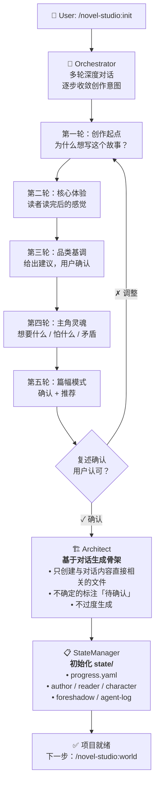

# init-project — 项目初始化 Workflow

## 状态机



## 详细步骤

### 步骤 1：Orchestrator 深度对话

**核心原则**：不填表，不问卷轰炸。每轮 1-2 个问题，根据用户回答动态调整下一轮问题。

```
第一轮 — 创作起点（开放问题）：
  先聊聊你想写的故事吧。
  可以不完整、可以只是一些碎片——
  比如某个场景、某个人物、某种感觉。
  或者你对市面上某类书不满意，想自己写一本不一样的。

第二轮 — 核心体验（根据第一轮追问）：
  你希望读者读完这本书后，心里留下什么感觉？
  （爽、燃、虐、悬疑感、被治愈、想了很多天）

第三轮 — 品类和基调（给出建议，让用户确认）：
  从你说的来看，天然适合 [品类]——
  但基调我想确认：偏 [A/B/C] 还是混合？

第四轮 — 主角灵魂（不问设定，问矛盾）：
  聊聊主角吧。不用想名字和设定——
  1. 最想要什么？
  2. 最怕什么？
  3. 这两个之间有什么矛盾？

第五轮 — 篇幅和模式（确认 + 推荐）：
  篇幅推荐 [建议]，模式推荐 [建议]。
  你觉得呢？

每轮结束后复述理解，用户确认再进入下一轮。
```

**快速通道**：如果用户一次性给出完整信息 → 复述总结 → 确认无误 → 跳过逐轮对话，直接创建。

### 步骤 2：Architect 创建工作区骨架

**核心原则**：只创建和对话内容直接相关的文件。不过度生成。

```
创建目录结构:
  my-novel/
  ├── core/
  ├── setting/
  │   ├── characters/
  │   ├── world/
  │   └── power-system/
  ├── outline/
  │   └── volumes/
  ├── chapters/
  ├── snippets/
  └── state/

创建文件（按需）:
  1. core/作品核心.md（作品级灵魂契约，单一权威）:
     - 一句话概括：logline
     - 读者承诺：核心体验/爽点/情绪（对话第二轮）
     - 基调：全书情绪底色
     - 主角内核：想要[X] / 害怕[Y] / 矛盾[Z]（对话第四轮）
     - 主线承诺：核心冲突/结局方向（一句话级）
     - 禁忌与红线：坚决不写
     - 注意：元信息（书名/品类/模式/篇幅）不写进 core，由 progress.yaml 的 workspace 块承载

  2. setting/硬规则.yaml（跨主题全局硬约束）:
     - 从品类配方提取不可破坏规则
     - 从对话中提取用户强调的核心约束
     - 力量等级 → setting/power-system/；主角初始身份 → setting/characters/主角.yaml 的 constraints

  3. setting/characters/主角.yaml:
     - 基于第四轮对话创建主角档案
     - 不确定的字段留空或标注「待确认」

  4. setting/power-system/:
     - 如果品类需要 → 按品类配方预设框架
     - 否则 → 创建空模板

  5. setting/world/:
     - 仅创建初始框架，不填充未讨论的内容

  6. setting/系统面板.md（仅系统爽文品类）:
     - 从品类配方 `genres/番茄系统爽文/panels.md` 读取通用模板作参考
     - 基于本书系统设计实例化并个性化：填入主角名、等级名称、属性种类、难度取值、面板标题叫法
     - 只保留本书剧情会出现的面板与字段，不照搬模板全部 9 个面板
     - 锁定为全书唯一权威：后续写作/检查/校正都只认本文件，不读模板
```

### 步骤 3：StateManager 初始化状态

```
创建 state/ 下所有文件:
  - progress.yaml: chapter=0, state_version=1, chunk_plan={}（空结构，chunk 启动时填充）
  - author.yaml: 空模板
  - reader.yaml: 空模板
  - character.yaml: 从 setting/characters/ 导入
  - foreshadow.yaml: 空模板（stats全部=0）
  - transaction-log.yaml: 首条 init 事务记录（txn: 1）
  - agent-log.yaml: 首条记录 "project initialized"
```

## 反模式（禁止）

- ❌ 用户说了一句就开始生成角色档案
- ❌ 一次性抛出 5 个问题让用户填表
- ❌ 用户还没确认理解就跳到「创建文件中...」
- ❌ 生成用户没要求的设定内容
