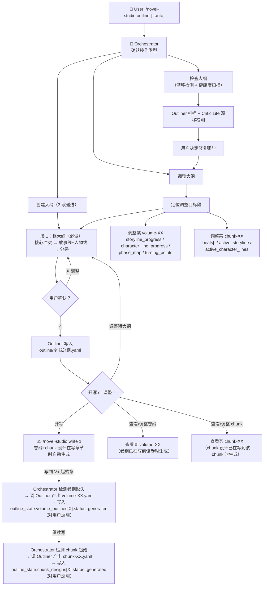

# outline — 大纲设计 Workflow（3 段大纲）

## 状态机



## 操作类型判断

Orchestrator 首先确认用户意图：

| 用户说 | 执行路径 |
|--------|---------|
| 「创建大纲」「从零开始」「设计大纲」 | 创建（段 1 粗大纲，3 轮对话） |
| 「调整第X卷」「改一下故事线」 | 调整（定位目标段） |
| 「检查大纲」「看看有什么问题」 | 检查（漂移检测 + 健康度扫描） |
| `/novel-studio:outline`（无参数） | 询问用户想做哪个 |
| `/novel-studio:outline --auto` | 全自动：段 1 每轮自动确认，跳过可选步骤 |

## 段 1：粗大纲（必做，3 轮对话）

### 第 1 轮：核心冲突与主题

```
Orchestrator 读取作品核心 + canon 摘要
问用户：
1. 核心冲突（如个人意志 vs 命运安排）
2. 读者承诺（读者读完的体验）
3. 必须写的标志性场景
```

### 第 2 轮：拆解故事线和人物线（核心新步骤）

```
Orchestrator 基于用户回答 + canon + 粗大纲的核心冲突，草拟：
- 故事线（按剧情主题，穿越多个角色）：
  - 每条线：theme（主题名）+ description + stakes（赌注）+ resolution_volume（收束卷）+ key_characters（参与推进的角色）
- 人物线（按 POV 角色，每个独立成长）：
  - 每个 POV 角色：direction（方向）+ start_state + end_state + growth_direction

展示方案，用户修改/确认。
检查项：
  - 每条故事线是否有角色推进（key_characters 非空）
  - 故事线和人物线是否平衡（避免故事线无人推进 / 人物线游离于故事线外）
```

### 第 3 轮：分卷粗规划

```
Orchestrator 基于故事线和人物线，草拟分卷方案：
- 每卷：chapter_range + function + line_primary + line_secondary + character_focus

展示方案，用户修改/确认。
```

**第一段确认后**：
- Orchestrator 将确认的内容传递给 Outliner，生成 `outline/全书总纲.yaml`
- Orchestrator 写入 `progress.outline_state.coarse_outline.status: "completed"` + `completed_at`
- 此后即可 `/novel-studio:write` 开写，**不强制**继续做段 2/段 3

## 段 2：卷纲（按需生成，写作时透明完成）

**不在 `/novel-studio:outline` 命令中生成**——由写章节流程按需触发。

**触发时机**：`/novel-studio:write N` 时 N 是新卷起始章（如 chapter 61 是 V2 起始） → Orchestrator 检测 `outline/volumes/volume-XX.yaml` 不存在 → 自动调 Outliner 产出（**对用户透明，不弹额外对话**）。

**Outliner 执行**：

```
输入：粗大纲中的该卷粗规划（function / line_primary / line_secondary / character_focus）
输出：
  - storyline_progress: 每条相关故事线的 start_state / end_state / key_beats / primary_carrier
  - character_line_progress: 每个相关人物的 start_state / end_state / key_beats / growth_marker
  - phase_map: 本卷节奏地图（5-10 章一组）
  - turning_points: 本卷关键转折点（双维度追踪 affects_storylines + affects_character_lines）
  - volume_end_hook: 本卷结尾钩子

写入：outline/volumes/volume-XX.yaml
Orchestrator 同步：progress.outline_state.volume_outlines[volume-XX].status = "generated" + generated_at
```

**用户主动查看/调整**：通过 `/novel-studio:outline 调整 volume-XX`，加载该卷卷纲，用户修改后 Outliner 写回。

## 段 3：chunk 设计（按需生成，写章节时透明完成）

**不在 `/novel-studio:outline` 命令中生成**——由写章节流程按需触发。

**触发时机**：`/novel-studio:write N` 时 N 是新 chunk 起始章（默认 5 章一 chunk） → Orchestrator 调 Outliner 产出（沿用现有触发流程）。

**Outliner 执行**：

```
输入：卷纲 + 粗大纲 + 上一 chunk 尾巴（如有）
输出：
  - active_storyline: 本 chunk 主推的故事线
  - active_character_lines: 本 chunk 主推的人物线
  - beats[]: 每 beat 含 function / pov / environment / options / target_words / must_include / must_avoid /
             chapter_end_anchor / advancing_storyline / advancing_character_line

写入：outline/chunks/chunk-XX.yaml
Orchestrator 同步：progress.outline_state.chunk_designs[chunk-XX].status = "generated" + generated_at
```

**用户主动查看/调整**：通过 `/novel-studio:outline 调整 chunk-XX`，加载该 chunk 设计，用户修改后 Outliner 写回。

## 调整流程

```
1. Orchestrator 确认调整目标段（粗大纲 / 某卷纲 / 某 chunk）
2. 只加载受影响的文件（不重新加载全书大纲）
3. 在目标段内进行多轮纠偏对话
4. 修改完检查跨段影响（比如改了故事线可能影响人物线和分卷）
5. 用户确认后 Outliner 写回
```

**跨段影响检测**：
- 改了粗大纲的 storylines[] → 检查卷纲的 storyline_progress 是否需要同步更新
- 改了粗大纲的 character_lines[] → 检查卷纲的 character_line_progress 是否需要同步更新
- 改了粗大纲的 volumes[] → 检查已生成的卷纲/chunk 是否需要重新生成
- 改了某卷纲 → 检查该卷及之后的所有 chunk 是否需要重新设计

## 检查流程

### 段 1 粗大纲检查

```
Outliner 执行 6 项检查：
1. 故事线完整性：每条线从埋下到收束，中间不消失
2. 故事线有人推进：每条 storylines[].key_characters 非空
3. 人物线独立性：每条 character_lines[] 有 start_state + end_state
4. 故事线与人物线平衡：避免故事线无人推进 / 人物线游离于故事线外
5. 分卷一致性：每卷都有主推故事线 + 重点人物线
6. 节奏分布：分卷粒度是否合理（避免某卷跨度过大/过小）
```

### 段 2 卷纲检查（指定 volume-XX）

```
1. storyline_progress 与粗大纲 volumes[] 的 line_primary/line_secondary 一致
2. character_line_progress 与粗大纲 character_focus 一致
3. turning_points 覆盖双维度（affects_storylines + affects_character_lines）
4. phase_map 是否有连续 10 章以上同强度（警告风险）
5. volume_end_hook 是否真的能驱动读者翻下一卷
```

### 段 3 chunk 检查（指定 chunk-XX）

```
1. beats[] 的 advancing_storyline 与 chunk.active_storyline 一致
2. beats[] 的 advancing_character_line 与 chunk.active_character_lines 一致
3. 是否每章恰好一个 chapter_end_anchor: true
4. 字数预算（target_words）总和是否在 ±15% 范围内
5. 是否每章都有合理的承接上一章的钩子
```

### 漂移检测（累积漂移）

```
由 Critic Lite 在每章/每 chunk 收尾时执行：
- 故事线漂移：实际写出的内容是否推进了 chunk.active_storyline.direction？
- 人物线漂移：POV 角色的行为是否符合 chunk.active_character_lines[].direction？

累积多章漂移 → 提示用户回大纲调整或继续（接受漂移）
```

## Outliner 输出文件

```
outline/
├── 全书总纲.yaml                # 段 1：故事线/人物线/分卷粗规划/交汇点
├── 伏笔地图.yaml（可选参考）    # 段 4：伏笔的埋设和回收规划（保留为可选）
├── volumes/                     # 段 2：按需生成
│   ├── volume-01.yaml
│   ├── volume-02.yaml
│   └── ...
└── chunks/                      # 段 3：按需生成
    ├── chunk-01.yaml
    ├── chunk-02.yaml
    └── ...
```

**注意**：旧 5 层大纲的 `故事线交错.yaml` 和 `角色弧光.yaml` 已并入段 1/段 2，**不再单独输出**。如旧文件存在，保留为"高级选项"，不强制迁移。

## 核心原则

1. **段 1 即可开写**：粗大纲（核心冲突 + 故事线 + 人物线 + 分卷）确认后即可 `/novel-studio:write`，段 2/段 3 在写作过程中按需生成
2. **规划到卷，不规划到章**：见 `agents/outliner.md` 核心原则
3. **故事线 vs 人物线分离**：剧情主题（穿越角色）和角色成长（独立完整）分离驱动
4. **每段确认**：不跳到下一段直到当前段用户满意
5. **大纲是地图不是轨道**：实际写作中的好想法应纳入大纲而非被扼杀
6. **调整最小影响**：改一处只检查相关连锁反应，不重写无关部分
7. **小步快爬**：避免「一次性把全书写完大纲」的负担，按需生成