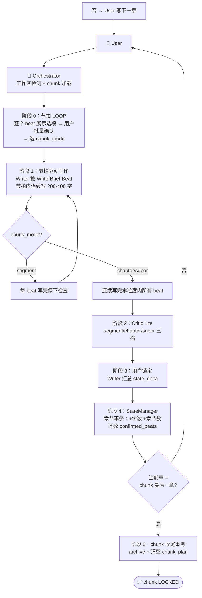
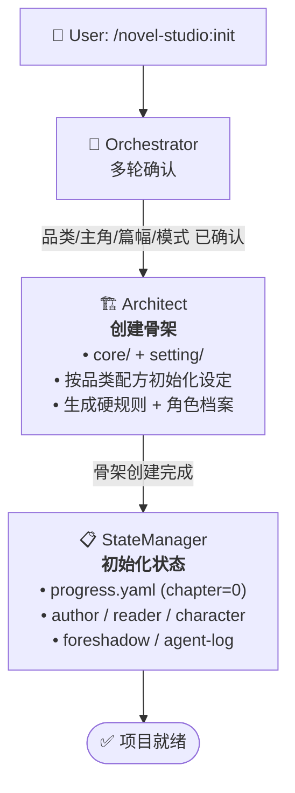
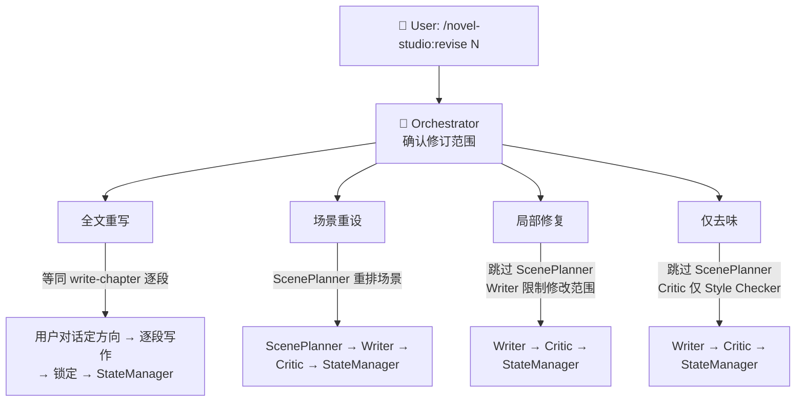
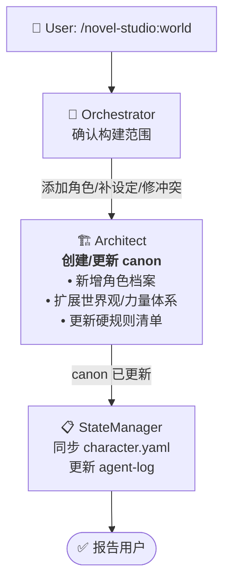
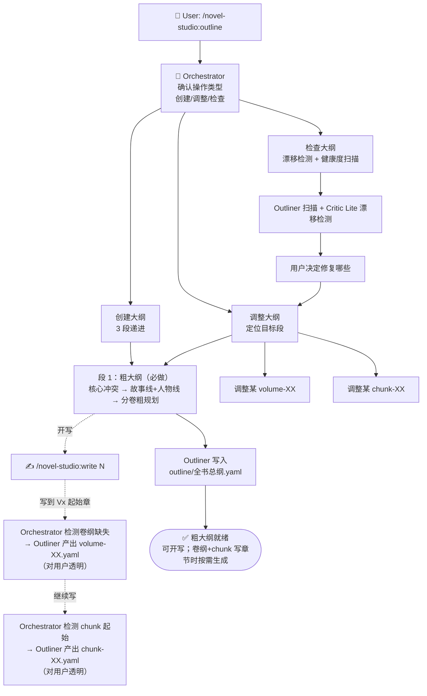
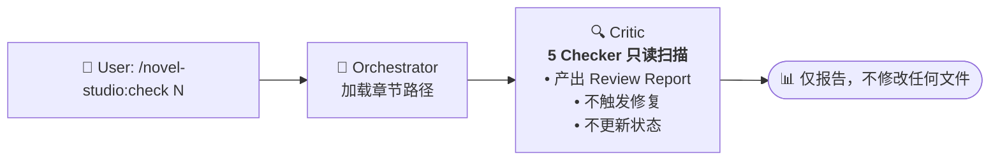

# 流水线定义

> 本文档是 novel-studio 所有 Agent 流水线的**唯一权威定义**。
> 每个 Agent 在自己的文件中引用本文档，不自行描述流水线位置。

---

## 一、写章节（write-chapter）

**触发**: `/novel-studio:write <N>` | `/novel-studio:write next`

**当前模式**：节拍批量确认 LOOP。详见 [`workflow-specs/write-chapter.md`](write-chapter.md)。

**关键设计**：

| 阶段 | 实现 |
|------|------|
| 方向确定 | LOOP 一次性展示所有 beat 选项，用户逐个确认（含自定义/跳到/回 LOOP） |
| 写作流程 | 节拍内一次写完 200-400 字；节拍间按 chunk_mode 决定停/续 |
| 质量检查 | Critic Lite 三档：segment（单 beat）/ chapter（整章）/ super（整 chunk） |
| 状态源 | `progress.yaml` 的 `chunk_plan` 块（单一源） |

**交接包流转**（节拍模式）：
| 步骤 | 交接包 |
|------|--------|
| Orchestrator → Writer（节拍） | WriterBrief-Beat（current_beat + 已锁方向 + 约束 + 不传 chunk 文件路径） |
| Writer → Orchestrator（beat 完成） | writer_beat_output（节拍 ID + 正文 + 字数 + hard_gate） |
| Orchestrator → Critic（Lite） | CriticBrief-Lite（mode: segment/chapter/super + 正文路径 + 连续性 + beat_plan） |
| Critic → Orchestrator | lite_report（通过/就地修/用户自决） |
| Orchestrator → StateManager | StateManagerBrief（state_delta + 锁定确认） |

---

## 二、初始化项目（init-project）

**触发**: `/novel-studio:init`

---

## 三、修订章节（revise-chapter）

**触发**: `/novel-studio:revise <N>`

修订范围判断与流程的完整定义见 [`workflow-specs/revise-chapter.md`](revise-chapter.md)。

---

## 四、世界观构建（worldbuilding）

**触发**: `/novel-studio:world`

---

## 五、大纲设计（outline）

**触发**: `/novel-studio:outline [--auto]`

**输出文件**:
- 段 1（必做）：`outline/全书总纲.yaml`（含故事线 + 人物线 + 分卷粗规划 + 交汇点）
- 段 2（按需）：`outline/volumes/volume-XX.yaml`（写到该卷时自动生成）
- 段 3（按需）：`outline/chunks/chunk-XX.yaml`（写到新 chunk 时自动生成）
- 段 4（可选参考）：`outline/伏笔地图.yaml`（保留为可选文件，不强制）

详见 [`workflow-specs/outline.md`](outline.md)。

---

## 六、质量检查（check）

**触发**: `/novel-studio:check <N>`

---

## Agent ↔ 流水线对应关系

| Agent | 出现在流水线 |
|-------|-------------|
| Orchestrator | 全部六条 |
| Architect | 初始化、世界观构建 |
| Outliner | 大纲设计（创建/调整/检查）+ **写章节按需生成卷纲（写到 Vx 起始章）+ 按需生成 chunk 设计（写到新 chunk 起始）** |
| ScenePlanner | 修订（场景重设） |
| Writer | 写章节（节拍 LOOP）、修订（全部四种范围） |
| Critic | 写章节（收尾 Lite 三档 + 新增故事线漂移 + 人物线漂移 2 个 Checker）、修订（场景重设/局部修复/仅去味）、质量检查 |
| StateManager | 写章节（节拍 LOOP）、初始化、修订、世界观构建 |

---

## 关键约束

1. **Agent 不自选后继**: 下一步由 workflow 定义和用户确认决定，不由 Agent 推荐
2. **Orchestrator 是唯一中转站**: Agent 之间不直接通信，所有信息经 Orchestrator 传递
3. **StateManager 是大状态唯一写入口**: 其他 Agent 只标记增量（state_delta），不直接写 `state/` 大状态文件（author/reader/character/foreshadow）。StateManager 同时维护事务版本（progress.state_version + transaction-log.yaml）
4. **Writer 不知道大纲全貌**：渐进披露，Writer 只知道当前 beat 的约束和禁止触碰清单（节拍模式） / 当前段的 Scene Contract（修订模式）
5. **交接包裁剪**: Orchestrator 按 `runtime/handoff-schema.md` 裁剪交接包，下游 Agent 只收到所需字段
6. **节拍模式不依赖 ScenePlanner 和全量 Critic**：写章节由 LOOP + 节拍驱动，ScenePlanner 仅在修订使用；Critic 在节拍/整章/整 chunk 收尾以 Lite 模式兜底（无 Scene Contract，不查信息泄漏）
7. **状态更新是版本化事务**: StateManager 每次更新递增 `state_version`、记 transaction-log；写前核对事务号。定义见 `runtime/state-schema.md` 第八节

---

## 交接包类型对照

每条流水线的 Agent 间传递使用专属交接包格式：

| 流转 | 交接包类型 | 说明 |
|------|-----------|------|
| Orchestrator → ScenePlanner | ScenePlannerBrief | 修订目标 + 现有章节结构 |
| Orchestrator → Writer | WriterBrief | scenes/five_beats + 约束 + 章尾落点 |
| Orchestrator → Critic | CriticBrief | 合并检查清单（forbid_touch + canon + pov） |
| Orchestrator → Critic（Lite） | CriticBrief-Lite | 正文路径 + 连续性上下文（写章节收尾） |
| Orchestrator → StateManager | StateManagerBrief | Review Report + state_delta |
| Orchestrator → Architect | 直接传递用户构想 | 不使用 Brief 格式（仅 init/worldbuilding） |

完整字段定义见 `runtime/handoff-schema.md`。
