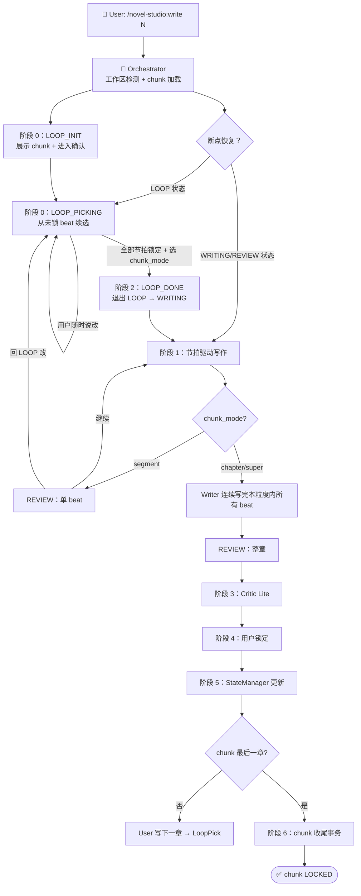

# write-chapter — 章节写作 Workflow（节拍 LOOP 模式）

## 状态机



## 核心变化（vs 旧版逐段模式）

| 维度 | 旧版（逐段） | 新版（节拍 LOOP） |
|------|------------|------------------|
| 方向确定 | 每段前给选项、用户确认一次 | LOOP 一次性展示整章/整 chunk 所有节拍，**逐个确认**（可任意回退改） |
| Writer | 每写 200-400 字停下等用户 | 节拍内连续写完，节拍间才停（segment 模式）或整章写完才停（chapter 模式） |
| 用户确认频次 | 一章 7-10 次 | 整章 N 个节拍只确认 1 次 LOOP + 1 次粒度选择 = **2 次** |
| 状态源 | `progress.yaml` 的 `chapter_state` + 各 segment 临时状态 | `progress.yaml` 的 `chunk_plan` 块（单一源） |
| 方向偏离保护 | 无 | segment 模式 Critic 检查每 beat vs `direction_locked`，偏离即硬伤 |

## 详细步骤

### 阶段 0：节拍 LOOP（写作前必走）

#### 0.1 入口与断点恢复

Orchestrator 启动时读 `progress.chunk_plan`：

| `loop_state` | 动作 |
|------------|------|
| 不存在 / 旧 v3 工作区（缺 chunk_plan 块） | 降级到旧逐段模式，提示用户 `/novel-studio:upgrade` |
| `LOOP` | 进入 LOOP_PICKING，从未锁 beat 续选 |
| `WRITING` + `current_beat` | 进入阶段 1，从该 beat 续写（幂等） |
| `REVIEW` | 展示已写内容等用户指令 |
| `LOCKED` / 全 null | chunk 已完成，请 `/novel-studio:write <下一章>` 触发新 chunk |

#### 0.2 新 chunk 启动

`/novel-studio:write N` 时若 N 是新 chunk 起始章：
1. Orchestrator 调用 Outliner 产出 `outline/chunks/chunk-XX.yaml`（含每 beat 的 options 池）
2. Orchestrator 初始化 `progress.chunk_plan`：

```yaml
chunk_plan:
  current_chunk: "chunk-01"
  source: "outline/chunks/chunk-01.yaml"
  chapter_range: [11, 15]
  chapter_word_target: 2000
  confirmed_beats: {}
  loop_state: "LOOP"
  loop_iteration: 1
  loop_entered_at: "<now>"
  beats_written: 0
  beats_total: 7                 # 当前章的 beat 总数
  words_written: 0
  writing_started_at: null
  loop_revert_log: []
```

#### 0.3 LOOP_INIT

```
🔄 节拍批量确认 Loop 启动

chunk-01 覆盖章节 11-15，共 7 个 beat（当前是第 11 章）。
我将依次展示每个 beat 的方向选项，你可以：
  - 选 A / B / C
  - 自定义方向
  - 或说「你来定」（Writer 现场发挥，功能不变）
  - 或说「跳到 beat-X」（跳到指定节拍）
  - 或说「回 LOOP」（回到上一 beat 重选）
  - 任何时候说「回 LOOP 改 beat-X」（回到这里改任意已选 beat）

开始选节拍？
```

用户说"开始选" → 进入 LOOP_PICKING。

#### 0.4 LOOP_PICKING

逐个 beat 展示（按 order 顺序，允许跳到）：

```
beat-3：[转折——系统评价"创造性使用"，主角意识到系统在测试思维方式]

选项：
  A. 选项A 完整描述
  B. 选项B 完整描述
  C. 选项C 完整描述

你的选择？或：
  - 自定义：[你的方向]
  - D / 你来定：Writer 现场决定（功能不变）
  - 跳到 beat-X：跳到指定节拍
  - 看已选：查看当前 confirmed  摘要
  - 回上一个：回到上一个 beat 重选
  - 全部选完了：即使有 beat 未选也进入 LOOP_DONE
```

**用户操作 → Orchestrator 写入 `progress.chunk_plan.confirmed_beats[beat-id]`**：

| 用户说 | 写入 |
|--------|------|
| `A` / `B` / `C` | `choice: 选项文本, source: "option", locked: true, locked_at: <now>` |
| `D` / `你来定` | `choice: null, source: "ai_improvised", locked: true, locked_at: <now>` |
| `自定义：[方向]` | `choice: 用户文本, source: "custom", locked: true, locked_at: <now>` |
| `跳到 beat-Y`（已锁） | 跳到 beat-Y；`loop_iteration +1`；`loop_revert_log` 追加一条 |
| `全部选完了` | 即使有 beat 未选也跳 LOOP_DONE |

#### 0.5 LOOP_DONE

```
✓ 本 chunk 共 7 个 beat，已确认 X 个（其中 Y 个用「你来定」）。

选择写作粒度（写作中何时停下来让你看）：
  1. segment：每个 beat 写完停下看（最精细）
  2. chapter：每章所有 beat 写完停下看（推荐）
  3. super：整个 chunk 写完才停

你的选择？
```

用户选 → Orchestrator 写入 `chunk_mode`，退出 LOOP：

```yaml
chunk_plan:
  loop_state: "WRITING"
  current_beat: "beat-1"     # 即将写第一个 beat
  beats_total: 7
  beats_written: 0
  words_written: 0
  writing_started_at: "<now>"
```

#### 0.6 LOOP 重入（任意阶段可触发）

任何状态下用户说"回到 LOOP" / "改 beat-X"：
1. `loop_state: LOOP`
2. `loop_iteration +1`
3. 目标 beat：
   - **未写**（`beats_written` 未计该 beat）：`locked: false`（让用户重选）
   - **已写**：`locked: true` 保留，但 `loop_revert_log` 追加：

```yaml
loop_revert_log:
  - beat_id: "beat-3"
    reverted_at: "<now>"
    reason: "用户指出方向偏离了卷节拍"
```

由用户决定后续是「覆盖重写该 beat」还是「插入补丁 beat」。

### 阶段 1：节拍驱动写作

#### 1.1 Orchestrator 调度 Writer（WriterBrief-Beat）

Orchestrator 为当前 beat 组装 `WriterBrief-Beat`（见 `runtime/handoff-schema.md` 二点五节），传给 Writer 写该 beat。

**不传 chunk 文件路径**——所有信息（beat function、direction_locked、字数、约束、上下游衔接）已在交接包里。

#### 1.2 Writer 行为（节拍内一次写完）

Writer 启动检查：
1. 提取 `current_beat.function`、`direction_locked`、`target_words`、`previous_beat_tail`、`next_beat_starter`
2. 检查 `chunk_context.previous_beat_written` 决定是接续还是新场景
3. **不读** chunk 文件、**不读** 后续 beat 的 direction_locked

节拍内连续起草（不再每段停下）：
1. 从 `previous_beat_tail` 开始承接（不重复最后一句、不重新建立场景）
2. 节拍内保持叙事连贯——不切场景、不切 POV、不换时间
3. 写到 `next_beat_starter` 描述之前停下
4. 字数控制：浮动 ±15%（target_words ± 15%）
5. 节拍内一次写完不打断

**节拍边界停下条件**（任一满足即停）：
1. 字数达到 `target_words` ± 15%
2. 写到 `next_beat_starter` 描述的内容
3. 节拍内部自然停顿点（对话收尾、场景落点、情绪落点）

Writer 输出 `writer_beat_output`（见 writer.md 第六步）。

#### 1.3 Orchestrator 按 chunk_mode 决定后续

Writer 写完一个 beat 后，Orchestrator 按 chunk_mode 行为：

| chunk_mode | 动作 |
|-----------|------|
| `segment` | 进入 REVIEW：展示刚写的 beat，等用户「继续 / 改 / 回 LOOP」 |
| `chapter` | 自动写下一个 beat（不打断），直到本章所有 beat 写完进入章节 REVIEW |
| `super` | 自动写下一个 beat（不打断），直到整个 chunk 所有 beat 写完进入 chunk REVIEW |

#### 1.4 节拍间用户操作（segment 模式专属）

| 用户说 | 动作 |
|--------|------|
| 「继续」 | `beats_written +1`，`words_written += beat 字数`，调 Writer 写下一个 beat |
| 「改这段」 | Writer 修订当前 beat（限本 beat 范围，不改 confirmed_beats） |
| 「回 LOOP 改 beat-X」 | 同 0.6 节 LOOP 重入 |
| 「这章到此结束」 | 提前进入 Critic Lite（即使本章 beat 未全写完） |

#### 1.5 Orchestrator 写入进度

每写完一个 beat：

```yaml
chunk_plan:
  current_beat: "beat-2"          # 推进到下一个 beat
  beats_written: 1                # +1
  words_written: 340              # += 当前 beat 字数
```

### 阶段 2：LOOP 退出 / Critic Lite

#### 2.1 触发时机

| chunk_mode | 进入 REVIEW 时机 |
|---|---|
| `segment` | 每个 beat 写完 |
| `chapter` | 本章所有 beat 写完（`beats_written == beats_total`） |
| `super` | 整个 chunk 所有章节所有 beat 写完 |

#### 2.2 Critic Lite 调度

Orchestrator 组装 `CriticBrief-Lite`（见 `runtime/handoff-schema.md` 第五节），包含：
- `mode: segment | chapter | super`
- `check_scope.beats`（本次检查范围）
- `beat_plan`（每 beat 的 `direction_locked`，用于方向一致性检查）
- `continuity_context`（segment 模式必填，含 `previous_beat_tail` 和 `next_beat_starter`）

Critic 判决（详见 `agents/critic.md` Lite 模式）：

| 判决 | 动作 |
|------|------|
| `通过` | 进入阶段 4 用户锁定 |
| `就地修` | Writer 限定范围修改（不改 confirmed_beats） |
| `用户自决` | 列给用户，用户决定修或不修 |

### 阶段 3：用户锁定 + 状态更新

#### 3.1 用户锁定

```
✅ 第 N 章初稿完成（约 XXXX 字）

[Critic Lite 报告]

需要我调整上面这些吗？还是直接锁定？
```

用户确认 → 进入阶段 4。

#### 3.2 Writer 汇总 state_delta

Writer 汇总全章级 `state_delta`（character_changes / threads_touched / new_threads_planted / reader_knowledge_gained / open_questions_answered / open_questions_raised），传给 Orchestrator。

#### 3.3 Orchestrator 调度 StateManager

Orchestrator 组装 `StateManagerBrief`（state_delta + user_confirmed: true），调度 StateManager。

#### 3.4 StateManager 更新（章节事务）

StateManager 在章节事务中**只做**：
- `progress.current.total_words += 本章字数`
- `progress.current.total_chapters_written += 1`
- `progress.state_version +1`
- `chapter_state.status: COMPLETED`
- `progress.chunk_plan.beats_written = 7`（设为本章总数）
- `transaction-log` 追加一条

StateManager **不做**：
- 不修改 `chunk_plan.confirmed_beats`（已用节拍不能回收）
- 不修改 `chunk_plan.loop_state`（保持 WRITING，下一章继续写）
- 不修改 `chunk_plan.loop_revert_log`（这是 LOOP 行为记录）

### 阶段 4：chunk 收尾（仅最后一章完成后）

StateManager 在最后一章（`current.chapter == chunk_plan.chapter_range[1]`）`COMPLETED` 时检测：

- `current.chapter == chapter_range[1]`（最后一章）
- `chapter_state.status: COMPLETED`
- `beats_written == beats_total`（注：`beats_total` 是当前章的 beat 数）

满足 → 触发「chunk 收尾事务」（独立事务，`state_version +1`，`trigger: "chunk_close"`）：
1. `outline/chunks/chunk-XX.yaml` 内容指针化进 `state/archive/chunks-archive.yaml`
2. `progress.yaml` 的 `chunk_plan` 块字段全部置 null / 0
3. `transaction-log.yaml` 追加 `trigger: "chunk_close"` 记录
4. `outline/chunks/chunk-XX.yaml` 文件**不删除**（保留为大纲设计真值）

## 上下文管理

节拍 LOOP 模式下，上下文持续增长。每写完一个 beat：

| 保留 | 不需要 |
|------|--------|
| 本章方向 + 已写节拍全文（进 chapter 文件） | 中间过程的废稿 |
| `chunk_plan.confirmed_beats` 当前值 | chunk 文件全部内容（Writer 不需要） |
| `loop_revert_log`（用于审计） | 已归档 chunk_plan 内容 |

WriterBrief-Beat 自带 `written_beats_tail` 数组，Writer 拿到最近几个 beat 的尾巴，避免重复读全文。

## 断点恢复

| `loop_state` | 恢复动作 |
|------------|---------|
| `LOOP` | 报告当前进度，进入 LOOP_PICKING 从未锁 beat 开始 |
| `WRITING` + `current_beat` | 报告进度，从 current_beat 重写（幂等，Writer 重写覆盖） |
| `REVIEW` | 报告进度，展示已写内容等用户指令 |
| `LOCKED` / 全 null | 提示 chunk 已完成，请 `/novel-studio:write <下一章>` |

## 反模式（禁止）

- 用户说"开始"后一次性写完整章（违反节拍模式"节拍内一次写完但节拍间停"）
- 每段超过 500 字（节拍上限 400 字，硬约束）
- 用户说"继续"就全自动跑完剩下的所有 beat（违反 segment 模式"每个 beat 写完停下"）
- Writer 越权读 chunk 文件（违反 WriterBrief-Beat 的 `must_not_read`）
- Writer 不等 Orchestrator 直接写下一个 beat（违反流程纪律——所有调度经过 Orchestrator）
- Writer 跨节拍连写（不读 `next_beat_starter` 写过头）
- 强行制造章尾钩子——钩子须从情节自然生长，为断章而反转/悬念造成阅读割裂
- 在事件半途强行切断——按字数（~2000）找自然停顿点收束，不在对话/打斗/揭示的高潮处戛然而止
- 章节事务中动 `chunk_plan.confirmed_beats`（已锁节拍不能回收）
- 状态变更不写 progress.yaml（违反单一源原则）

## 兼容性

旧 v3 工作区（缺 `chunk_plan` 块）→ Orchestrator 检测后降级到旧逐段模式（保留 `/novel-studio:write N` 命令可用）。`/novel-studio:upgrade` 可升级到节拍模式。