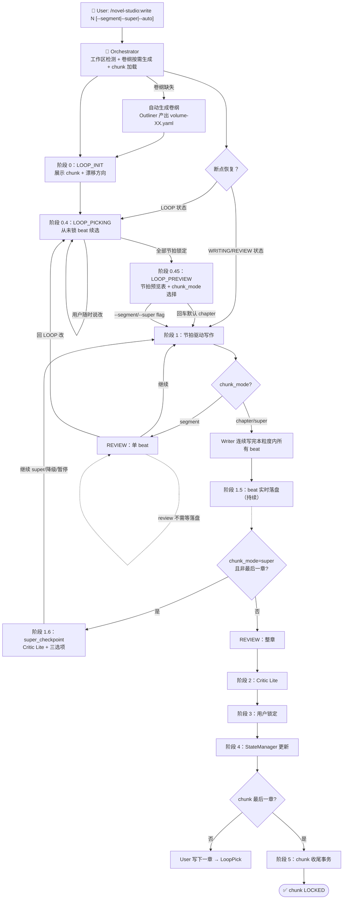

# write-chapter — 章节写作 Workflow（节拍 LOOP 模式）

## 状态机



## 设计要点

| 维度 | 实现 |
|------|------|
| 方向确定 | LOOP 一次性展示整章/整 chunk 所有节拍，**逐个确认**（可任意回退改） |
| 预览前置 | LOOP_PREVIEW 阶段 0.45：先看节拍预览表再选粒度——避免「还没看到全貌」时决策 |
| Writer | 节拍内连续写完，节拍间才停（segment 模式）或整章写完才停（chapter 模式）或整 chunk 但每章停下（super 模式） |
| super 防跑偏 | super_checkpoint 阶段 1.6：每章完成后 Critic Lite + 三选项（继续/降级/暂停） |
| 用户确认频次 | 整章 N 个节拍只确认 1 次 LOOP + 1 次粒度选择 = **2 次**；super 模式每章额外加 1 次 checkpoint |
| 状态源 | `progress.yaml` 的 `chunk_plan` 块（chunk 进度）+ `outline_state` 块（大纲产物状态） |
| 方向偏离保护 | segment 模式 Critic 检查每 beat vs `direction_locked`；所有模式 Critic 检查故事线漂移 + 人物线漂移 |

## 详细步骤

### 阶段 0：节拍 LOOP（写作前必走）

#### 0.1 入口与断点恢复

Orchestrator 启动时读 `progress.chunk_plan`：

| `loop_state` | 动作 |
|------------|------|
| `LOOP` | 进入 LOOP_PICKING，从未锁 beat 续选 |
| `WRITING` + `current_beat` | 进入阶段 1，从该 beat 续写（幂等） |
| `REVIEW` | 展示已写内容等用户指令 |
| `LOCKED` / 全 null | chunk 已完成，请 `/novel-studio:write <下一章>` 触发新 chunk |

**未初始化工作区**（chunk_plan 缺失）→ 提示用户先执行 `/novel-studio:init` 初始化项目。

#### 0.2 新 chunk 启动

`/novel-studio:write N` 时若 N 是新 chunk 起始章：

1. **卷纲按需生成检测**（新增，3 段大纲改造）：
   - Orchestrator 读 `outline/全书总纲.yaml` 的 `volumes[]`，判断 N 属于哪一卷（`chapter_range` 包含 N）
   - 检测 `outline/volumes/volume-XX.yaml` 是否存在
   - **不存在** → 自动调 Outliner 产出卷纲（含 `storyline_progress` + `character_line_progress` + `pacing_map` + `turning_points`）
   - 卷纲生成完成后写入 `progress.outline_state.volume_outlines[volume-XX].status: "generated"` + `generated_at`
   - **对用户透明**：不弹额外对话，自动完成
2. **跨卷检测**：Orchestrator 检查 `outline/volumes/volume-XX.yaml` 的 `chapter_range`，若准备启动的 chunk（默认 5 章）跨卷边界，按 `runtime/state-schema.md` 10.7 拆分规则提示用户拆分；用户确认后调 Outliner 分别产出 `chunk-XX.yaml` 和 `chunk-XX+1.yaml`
3. Orchestrator 调用 Outliner 产出 `outline/chunks/chunk-XX.yaml`（含每 beat 的 options 池）
4. **新增**：Outliner 设计 chunk 时从卷纲提取 `active_storyline` + `active_character_lines` + 单 beat 的 `advancing_storyline`/`advancing_character_line`，写入 chunk 文件
5. Orchestrator **只加载 `progress.chunk_plan.source` 指向的当前 chunk 文件**，不扫描 `outline/chunks/` 目录——已归档的旧 chunk 文件不会被误加载
6. Orchestrator 初始化 `progress.chunk_plan`：

```yaml
chunk_plan:
  current_chunk: "chunk-01"
  source: "outline/chunks/chunk-01.yaml"
  chapter_range: [11, 15]
  chapter_word_target: 2000        # chunk 级值（如有）优先；fallback 到 workspace.chapter_word_target
  chunk_mode: null                # LOOP_DONE 阶段 0.45 才写入；此处留 null
  confirmed_beats: {}
  loop_state: "LOOP"
  loop_iteration: 1
  loop_entered_at: "<now>"
  beats_written: 0
  beats_total_current_chapter: null  # 当前章的 beat 总数——**LOOP_DONE 进入 WRITING 时由 Orchestrator 算 `len([b for b in chunk.beats if b.chapter == chunk_plan.chapter_range[0]])` 写入**；每章进入 WRITING 前重置（O1 修复）
  words_written: 0
  writing_started_at: null
  loop_revert_log: []
```

7. **新增**：写入 `progress.outline_state.chunk_designs[chunk-XX].status: "generated"` + `generated_at`

#### 0.3 LOOP_INIT

```
🔄 节拍批量确认 Loop 启动

chunk-01 覆盖章节 11-15，共 7 个 beat（当前是第 11 章）。

本 chunk 主推：
   故事线：[sl-XXX 主题名] — [当前方向]
   人物线：[char-XXX 角色名] — [当前方向]

这意味着 Writer 在节拍内会严格遵循这两个方向——
避免「写着写着忘了大方向」。

我将依次展示每个 beat 的方向选项，你可以：
  - 选 A / B / C
  - 自定义方向
  - 或说「你来定」（Writer 现场发挥，功能不变）
  - 或说「跳到 beat-X」（跳到指定节拍）
  - 或说「回 LOOP」（回到上一 beat 重选）
  - 任何时候说「回 LOOP 改 beat-X」（回到这里改任意已选 beat）

开始选节拍？
```

用户说"开始选" → 进入 LOOP_PICKING。

#### 0.3.5 Fast Chunk 模式（A3 修复）

**触发条件**：用户说「fast chunk」「快速 chunk」「复用节奏」「跳过 LOOP」等指令，或连续第 2+ 个 chunk 启动时用户主动选择。

**行为差异**：
- **跳过所有 beat 选项展示**——直接复用上一 chunk 的节奏（chunk 文件默认节奏模板）
- **只问关键转折 beat**：从 chunk 文件中识别 `importance: "key_turn"` 或 `function` 含"转折/高潮/揭示/收尾"的 beat（通常 1-3 个），仅展示这些
- **其他 beat 默认 "你来定"（Writer 现场发挥）**，进入 WRITING 后由 Writer 按 `direction_locked = null` 自由发挥
- **chunk_mode 默认 chapter**（平衡检查密度与连贯性）

**典型对话**：

```
🔄 Fast Chunk 启动

chunk-02 覆盖章节 16-20，共 9 个 beat。
复用 chunk-01 节奏（每章 1 关键转折 + 2-3 自由 beat）。

需要你确认的 2 个关键转折 beat：
  - beat-3：高潮——主角与宿敌的正面对决
  - beat-7：揭示——XX角色的真实身份暴露

[展示 beat-3 + beat-7 的选项]

其他 7 个 beat 默认「你来定」，Writer 现场发挥。

开始？
```

**适用场景**：
- 第 2+ 个 chunk（用户已对前文有强记忆）
- 长篇创作中后段（10+ chunk 后）
- 用户主动希望跳过 LOOP 冗余对话

**不适用场景**：
- 第 1 个 chunk（需要充分讨论方向）
- 关键转折 chunk（卷末/完本 chunk）

**约束**：
- fast chunk 模式下，`source: ai_improvised` 的比例更高——Writer 承担更多方向决策
- 用户仍可随时说"回 LOOP 改 beat-X"——回退到 LOOP_PICKING
- 仍可随时说"这章到此结束"提前结束

#### 0.4 LOOP_PICKING

逐个 beat 展示（按 order 顺序，允许跳到）：

```
beat-3：[转折——系统评价"创造性使用"，主角意识到系统在测试思维方式]

本 beat 推进：
   故事线 [sl-XXX]：[方向]
   人物线 [char-XXX]：[方向]

选项：
  A. 选项A 完整描述
  B. 选项B 完整描述
  C. 选项C 完整描述

你的选择？或：
  - 自定义：[你的方向]
  - D / 你来定：Writer 现场决定（功能不变）
  - 跳到 beat-X：跳到指定节拍
  - 看已选：查看当前 confirmed  摘要
  - 回上一个：回到上一个 beat 重选
  - 全部选完了：即使有 beat 未选也进入 LOOP_PREVIEW
```

**用户操作 → Orchestrator 写入 `progress.chunk_plan.confirmed_beats[beat-id]`**：

| 用户说 | 写入 |
|--------|------|
| `A` / `B` / `C` | `choice: 选项文本, source: "option", locked: true, locked_at: <now>` |
| `D` / `你来定` | `choice: null, source: "ai_improvised", locked: true, locked_at: <now>` |
| `自定义：[方向]` | `choice: 用户文本, source: "custom", locked: true, locked_at: <now>` |
| `跳到 beat-Y`（已锁） | 跳到 beat-Y；`loop_iteration +1`；`loop_revert_log` 追加一条 |
| `全部选完了` | 即使有 beat 未选也跳 LOOP_PREVIEW（阶段 0.45） |

#### 0.45 LOOP_PREVIEW（节拍预览 + chunk_mode 选择）

```
✅ 节拍方向全部确认（X 个锁定，Y 个用「你来定」）

📊 本 chunk 节奏预览：
  beat-1 [钩子]    → A 接上章结尾       [locked]    ~280 字
  beat-2 [承接]    → B 场景切换        [locked]    ~320 字
  beat-3 [转折]    → C 状态描写        [locked]    ~360 字
  beat-4 [高潮]    → 用户自定义        [custom]    ~400 字
  ...
  预计总字数：~2400 字（±15%）

[如果估算字数偏差大 → 提示用户回 LOOP 改 beat]

写作粒度（回车 = chapter 推荐档 / --segment / --super / --super-strict）：
> 
```

**用户响应 → Orchestrator 写入 `chunk_plan.chunk_mode`**：

| 用户输入 | chunk_mode | 后续行为 |
|---------|-----------|---------|
| 回车（默认） | `chapter` | 每章所有 beat 写完停下看 |
| `chapter` | `chapter` | 同上 |
| `segment` | `segment` | 每个 beat 写完停下看 |
| `super` | `super` | 每章完成后插入 checkpoint（阶段 1.6） |
| `super-strict` | `super-strict` | 整 chunk 一气呵成（无 checkpoint，保留原行为） |
| `回 LOOP 改 beat-X` | 不变 | 回到 LOOP_PICKING 重选指定 beat |

**Orchestrator 写入 `chunk_plan.chunk_mode` + 退出 LOOP**：

```yaml
chunk_plan:
  chunk_mode: "chapter"           # 用户选的粒度
  loop_state: "WRITING"
current_beat: "beat-1"     # 即将写第一个 beat
  beats_total_current_chapter: <动态计算>  # 从 chunk.beats 按 chapter 字段过滤后取 len()（O1 修复——非 chunk 级静态值）
  beats_written: 0
  words_written: 0
  writing_started_at: "<now>"

# ★ A2 修复——进入 WRITING 时同步设置 in_progress_chapter
in_progress_chapter:
  status: "writing"               # writing | reviewing | locked | normal
  chapter: <current.chapter>      # 此时 current.chapter 还未 +1（尚未 LOCKED）
  started_at: "<now>"
  beats_progress: []              # 每 beat 完成后追加 {beat_id, word_count, finished_at}
```

**为什么先预览再选粒度**：用户对节奏没概念时，被迫在「还没看到全貌」时选粒度容易出错。先看到 7 个 beat 的方向分布，再选「写作中何时停下来」，决策质量更高。

#### 0.6 LOOP 重入（任意阶段可触发）

任何状态下用户说"回到 LOOP" / "改 beat-X"：
1. `loop_state: LOOP`
2. `loop_iteration +1`
3. **Orchestrator 重新从 `outline/chunks/chunk-XX.yaml` 读取目标 beat 的 options 池**——WriterBrief-Beat 只含 `direction_locked`，不含完整 options；chunk 文件是设计真值
4. 目标 beat：
   - **未写**（`beats_written` 未计该 beat）：`locked: false`（让用户重选）
   - **已写**：`locked: true` 保留，但 `loop_revert_log` 追加：

```yaml
loop_revert_log:
  - beat_id: "beat-3"
    reverted_at: "<now>"
    reason: "用户指出方向偏离了卷节拍"
```

由用户决定后续是「覆盖重写该 beat」还是「插入补丁 beat」。

### 阶段 1：节拍驱动写作

#### 1.1 Orchestrator 调度 Writer（WriterBrief-Beat）

Orchestrator 为当前 beat 组装 `WriterBrief-Beat`（见 `runtime/handoff-schema.md` 二点五节），传给 Writer 写该 beat。

**不传 chunk 文件路径**——所有信息（beat function、direction_locked、字数、约束、上下游衔接）已在交接包里。

#### 1.2 Writer 行为（节拍内一次写完）

Writer 启动检查：
1. 提取 `current_beat.function`、`direction_locked`、`target_words`、`previous_beat_tail`、`next_beat_starter`
2. 检查 `chunk_context.previous_beat_written` 决定是接续还是新场景
3. **不读** chunk 文件、**不读** 后续 beat 的 direction_locked

节拍内连续起草（不再每段停下）：
1. 从 `previous_beat_tail` 开始承接（不重复最后一句、不重新建立场景）
2. 节拍内保持叙事连贯——不切场景、不切 POV、不换时间
3. 写到 `next_beat_starter` 描述之前停下
4. 字数控制：浮动 ±15%（target_words ± 15%）
5. 节拍内一次写完不打断

**节拍边界停下条件**（任一满足即停）：
1. 字数达到 `target_words` ± 15%
2. 写到 `next_beat_starter` 描述的内容
3. 节拍内部自然停顿点（对话收尾、场景落点、情绪落点）

Writer 输出 `writer_beat_output`（见 writer.md 第六步）。

#### 1.3 Orchestrator 按 chunk_mode 决定后续

Writer 写完一个 beat 后，Orchestrator 按 chunk_mode 行为：

| chunk_mode | 动作 |
|-----------|------|
| `segment` | 进入 REVIEW：展示刚写的 beat，等用户「继续 / 改 / 回 LOOP」 |
| `chapter` | 自动写下一个 beat（不打断），直到本章所有 beat 写完进入章节 REVIEW |
| `super` | 自动写下一个 beat（不打断），直到整个 chunk 所有 beat 写完进入 chunk REVIEW |

#### 1.4 节拍间用户操作（segment 模式专属）

| 用户说 | 动作 |
|--------|------|
| 「继续」 | `beats_written +1`，`words_written += beat 字数`，调 Writer 写下一个 beat |
| 「改这段」 | Writer 修订当前 beat（限本 beat 范围，不改 confirmed_beats） |
| 「回 LOOP 改 beat-X」 | 同 0.6 节 LOOP 重入 |
| 「这章到此结束」 | 提前进入 Critic Lite（即使本章 beat 未全写完） |

#### 1.5 Orchestrator 写入进度

每写完一个 beat：

```yaml
chunk_plan:
  current_beat: "beat-2"          # 推进到下一个 beat
  beats_written: 1                # +1
  words_written: 340              # += 当前 beat 字数

# ★ A2 修复——每 beat 完成后追加到 in_progress_chapter.beats_progress
in_progress_chapter:
  status: "writing"               # 保持 writing（进入 REVIEW 时才改为 reviewing）
  chapter: <current.chapter>
  beats_progress:                 # append {beat_id, word_count, finished_at}
    - beat_id: "beat-1"
      word_count: 340
      finished_at: "<now>"
```

### 阶段 1.5：beat 实时落盘（Writer 自执行，所有 chunk_mode 通用）

Writer 每个 beat 写完 + 输出 `writer_beat_output` **之后立即**把该 beat 文本追加到 `chapter_file_path`：

- **纯正文**——不写 `## beat-N` 二级标题，不写 YAML frontmatter，不写文件级 metadata
- **追加式**——新 beat 接在已有内容末尾，节拍间用一个空行分隔；不覆盖已有 beat
- **所有 chunk_mode 通用**——segment 模式下逐拍落盘不再与逐拍检查冲突（落盘不打断流程）
- **作者可随时打开 `chapters/第N章-XXX.md` 看实时进度**——这是 O2 修复的核心动机
- **章节文件 = beat 进度的真值**——`chunk_plan` 是元数据，恢复时以文件已落盘内容为准（见「断点恢复」节）
- **修订语义**（回 LOOP 改已写 beat）：Writer 重写该 beat 文本后 → Orchestrator 告知该 beat 在章节文件中的字符范围 → Writer 替换该范围（不重写整个文件）。整章成稿后用户手动修订不再被 Writer 覆盖——这是预期行为，不是 bug

落盘完成 → 进入阶段 1.6（仅 super 模式且非最后一章）或阶段 2（其他情况）。落盘独立于 Critic Lite 触发逻辑。

### 阶段 1.6：super 模式章节 checkpoint（仅 super，非最后一章）

**触发条件**：`chunk_mode == "super"` AND `current.chapter != chapter_plan.chapter_range[1]`（非最后一章）。

**最后一章不触发**：当 `current.chapter == chapter_range[1]` 时，super 模式直接进入阶段 2 完整 Critic Lite（覆盖整 chunk 所有章节所有 beat），走 LOCKED 流程。

**行为**：

1. Orchestrator 调度 Critic Brief-Lite，`mode: "chapter"`，并标记 `pause_reason: "super_checkpoint"`（让 Critic 知道这是 mid-chunk 调用，阈值照旧）
2. Critic Lite 产出 lite_report（含故事线漂移 + 人物线漂移检查结果）
3. Orchestrator 展示报告 + 三选项：

```
✅ 第 N 章完成（约 XXXX 字，super 模式 checkpoint）

[Critic Lite 报告]

本章结束。下一步：
  1. 继续 super — 写下一章（chapter-N+1），写完继续 checkpoint
  2. 降级为 chapter — 后续章节在阶段 2（每章 Critic Lite）正常停下
  3. 暂停 — 进入 REVIEW，本 chunk 状态保留

你的选择？
```

4. 用户响应：

| 选择 | Orchestrator 动作 |
|------|------------------|
| 1. 继续 super | 重置 `current_beat: "beat-1"` + `beats_written: 0` + `words_written: 0` + `writing_started_at: <now>`，调 Writer 写下一章（保留 `chunk_mode: "super"`） |
| 2. 降级为 chapter | 改 `chunk_mode: "chapter"`，重置 `current_beat: "beat-1"` 等；后续章节按普通 chapter 模式走 |
| 3. 暂停 | `loop_state: "REVIEW"`，等待用户进一步指令 |

**为什么需要 checkpoint**：原 super 模式是「整 chunk（5 章）写完才让用户看」，跑偏要等 35+ beat 后才暴露。引入 checkpoint 后每章完成都停下，让用户确认「方向没偏」再继续写下一章。

**降级机制**：如果用户在中途发现 super 太激进，可降级为 chapter（更稳但节奏更慢）；不会丢失已写内容。

### 阶段 2：LOOP 退出 / Critic Lite

#### 2.0 in_progress_chapter 状态推进（A2 修复）

进入阶段 2 时，Orchestrator 把 `in_progress_chapter.status` 从 `writing` 改为 `reviewing`（章节仍在 review 中，未 LOCKED）：

```yaml
in_progress_chapter:
  status: "reviewing"             # writing → reviewing
  chapter: <current.chapter>
  started_at: "<之前 started_at>"  # 不变
  beats_progress: [...]            # 本章所有已完成的 beat（完整数组）
  reviewing_at: "<now>"
```

#### 2.1 触发时机

| chunk_mode | 进入 REVIEW 时机 |
|---|---|
| `segment` | 每个 beat 写完 |
| `chapter` | 本章所有 beat 写完（`beats_written == beats_total_current_chapter`） |
| `super` | 整个 chunk 所有章节所有 beat 写完 |

#### 2.2 Critic Lite 调度

Orchestrator 组装 `CriticBrief-Lite`（见 `runtime/handoff-schema.md` 第五节），包含：
- `mode: segment | chapter | super`
- `check_scope.beats`（本次检查范围）
- `beat_plan`（每 beat 的 `direction_locked`，用于方向一致性检查）
- `continuity_context`（segment 模式必填，含 `previous_beat_tail` 和 `next_beat_starter`）
- `pause_reason: "" | "super_checkpoint"`（新增——super 模式章节 checkpoint 时填该值，其他场景空字符串）
- `drift_check`（新增——漂移检测清单）：
  - `storyline_expected`: `{ storyline_id, direction, carrier }` 从当前 beat/chunk 的 `active_storyline` 提取
  - `character_line_expected`: `{ character_id, direction, growth_target }` 从当前 beat 的 `character_line_direction` 提取

Critic 判决（详见 `agents/critic.md` Lite 模式）：

| 判决 | 动作 |
|------|------|
| `通过` | 进入阶段 3 用户锁定 |
| `就地修` | Writer 限定范围修改（不改 confirmed_beats） |
| `用户自决` | 列给用户，用户决定修或不修 |

**漂移严重度阈值**（按 mode 分档）：

| 漂移严重度 | segment | chapter | super |
|----------|---------|---------|-------|
| 无 | 0 beat 偏离 | 0 处偏离 | 0 处偏离 |
| 轻微 | 1 beat 偏离 | 1-2 处偏离 | 1-3 处偏离 |
| 严重 | ≥2 beat 偏离 | ≥3 处偏离 | ≥4 处偏离 |

| 漂移严重度 | segment | chapter | super |
|----------|---------|---------|-------|
| 无 | 通过 | 通过 | 通过 |
| 轻微 | 用户自决 | 用户自决 | 用户自决 |
| 严重 | 就地修 | 就地修 | 就地修 |

### 阶段 3：用户锁定 + 状态更新

#### 3.1 用户锁定

```
✅ 第 N 章初稿完成（约 XXXX 字）

[Critic Lite 报告]

需要我调整上面这些吗？还是直接锁定？
```

用户确认 → 进入阶段 4。

#### 3.2 Writer 汇总 state_delta

Writer 汇总全章级 `state_delta`（character_changes / threads_touched / new_threads_planted / reader_knowledge_gained / open_questions_answered / open_questions_raised），传给 Orchestrator。

#### 3.3 Orchestrator 调度 StateManager

Orchestrator 组装 `StateManagerBrief`（state_delta + user_confirmed: true），调度 StateManager。

#### 3.4 StateManager 更新（章节事务）

StateManager 在章节事务中**只做**：
- `progress.current.total_words += 本章字数`
- `progress.current.total_chapters_written += 1`
- `progress.current.chapter += 1`
- `progress.state_version +1`
- `progress.chunk_plan.beats_written = 本章 beat 数`
- `transaction-log` 追加一条
- **★ A2 修复——LOCKED 状态推进**：StateManager 完成章节事务后，把 `progress.in_progress_chapter.status` 从 `writing`/`reviewing` 改为 `locked` + `chapter: null`（下一个 chapter 的 WRITING 启动时 Orchestrator 会重新填充新值）

StateManager **不做**：
- 不修改 `chunk_plan.confirmed_beats`（已用节拍不能回收）
- 不修改 `chunk_plan.loop_state`（保持 WRITING，下一章继续写）
- 不修改 `chunk_plan.loop_revert_log`（这是 LOOP 行为记录）

#### 3.5 Orchestrator 准备进入下一章

章节事务完成后（`current.chapter +1` 后），Orchestrator 检测：
- 若 `current.chapter` 仍在 `chapter_range` 内（未到最后一章）：进入下一章 → **从 `outline/chunks/chunk-XX.yaml` 用 `len([b for b in chunk.beats if b.chapter == current.chapter])` 读新章 beat 数，重置 `beats_total_current_chapter` 为新值**（详见 O1 修复）→ 推进 `current_beat` 到新章的 `beat-1` → 继续 WRITING
- 若 `current.chapter == chapter_range[1]`：触发阶段 4 chunk 收尾

**关键**：`beats_total_current_chapter` 不是 chunk 级静态值，是**当前章节维度**——每章进入 WRITING 前必须重置。Orchestrator 不写此字段时，chunk 收尾的双重条件永远不满足。

### 阶段 4：chunk 收尾（仅最后一章完成后）

StateManager 在最后一章完成后检测（**双重条件**）：
- `current.chapter == chunk_plan.chapter_range[1]`
- `beats_written == beats_total_current_chapter`（注：`beats_total_current_chapter` 是当前章的 beat 数，由 Orchestrator 在每章进入 WRITING 前重置）

满足 → 触发「chunk 收尾事务」（独立事务，`state_version +1`，`trigger: "chunk_close"`）：
1. `outline/chunks/chunk-XX.yaml` 内容指针化进 `state/archive/chunks-archive.yaml`
2. `progress.chunk_plan.loop_revert_log` 全部追加进 `state/archive/chunks-archive.yaml` 该 chunk 条目下（审计不丢），`progress.chunk_plan.loop_revert_log` 清空
3. `progress.yaml` 的 `chunk_plan` 块字段全部置 null / 0；`chunk_mode` 随 chunk_plan 整体清空
4. `progress.outline_state.chunk_designs[chunk-XX].status` 改为 `"archived"` + 写入 `archived_at`
5. **★ 卷纲完成判定**（W5 修复）：若当前 chunk 的 `chapter_range[1]` 等于 `outline/全书总纲.yaml` 中对应 volume 的 `chapter_range[1]`（卷末章）→ 把 `progress.outline_state.volume_outlines[volume-XX].status` 从 `"generated"` 改为 `"completed"` + 写入 `completed_at`（该事务的副作用；状态机不动）
6. `transaction-log.yaml` 追加 `trigger: "chunk_close"` 记录
7. `outline/chunks/chunk-XX.yaml` 文件**不删除**（保留为大纲设计真值）——下次启动新 chunk 时 Orchestrator 按 `progress.chunk_plan.source` 指针加载，不会误读旧文件

## 上下文管理

节拍 LOOP 模式下，上下文持续增长。每写完一个 beat：

| 保留 | 不需要 |
|------|--------|
| 本章方向 + 已写节拍全文（进 chapter 文件） | 中间过程的废稿 |
| `chunk_plan.confirmed_beats` 当前值 | chunk 文件全部内容（Writer 不需要） |
| `loop_revert_log`（用于审计） | 已归档 chunk_plan 内容 |

WriterBrief-Beat 自带 `written_beats_tail` 数组，Writer 拿到最近几个 beat 的尾巴，避免重复读全文。

## 断点恢复

| `loop_state` | 恢复动作 |
|------------|---------|
| `LOOP` | 报告当前进度，进入 LOOP_PICKING 从未锁 beat 开始 |
| `WRITING` + `current_beat` | 报告进度，从 current_beat 重写（幂等，Writer 重写覆盖） |
| `REVIEW` | 报告进度，展示已写内容等用户指令 |
| `LOCKED` / 全 null | 提示 chunk 已完成，请 `/novel-studio:write <下一章>` |

## 反模式（禁止）

- 用户说"开始"后一次性写完整章（违反节拍模式"节拍内一次写完但节拍间停"）
- 每段超过 500 字（节拍上限 400 字，硬约束）
- 用户说"继续"就全自动跑完剩下的所有 beat（违反 segment 模式"每个 beat 写完停下"）
- Writer 越权读 chunk 文件（违反 WriterBrief-Beat 的 `must_not_read`）
- Writer 不等 Orchestrator 直接写下一个 beat（违反流程纪律——所有调度经过 Orchestrator）
- Writer 跨节拍连写（不读 `next_beat_starter` 写过头）
- 强行制造章尾钩子——钩子须从情节自然生长，为断章而反转/悬念造成阅读割裂
- 在事件半途强行切断——按字数（~2000）找自然停顿点收束，不在对话/打斗/揭示的高潮处戛然而止
- 章节事务中动 `chunk_plan.confirmed_beats`（已锁节拍不能回收）
- 状态变更不写 progress.yaml（违反单一源原则）