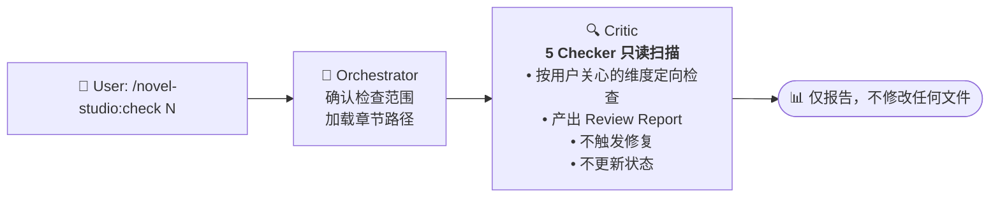

# check — 质量检查 Workflow

## 状态机



## 详细步骤

### 步骤 1：Orchestrator 确认检查范围

```
1. 读取 progress.yaml 确认章节存在
2. 询问用户想关注什么：
   - 「全部过一遍」→ 5 个 Checker 全部
   - 「AI 味 / 文风」→ Style Checker（重点）+ Pace Checker（辅助）
   - 「角色有没有崩」→ Character Checker + Logic Checker
   - 「节奏 / 太拖 / 太快」→ Pace Checker + Logic Checker
   - 「信息控制 / 泄露」→ Info Leak Checker + Logic Checker
   - 「逻辑 / 情节 bug」→ Logic Checker
   - 「读着不舒服但说不上来」→ Style → Character → Pace（逐步）
3. 加载章节正文路径，传递给 Critic
```

### 步骤 2：Critic 定向检查

```
Critic 按用户指定的维度运行对应 Checker：
- 只运行用户要求的 Checker，不跑无关的
- 只输出 Review Report
- 不修改正文
- 不更新状态文件
```

### 步骤 3：报告

```
Orchestrator 向用户呈现问题列表。
如果用户说「需要修复」→ 建议使用 /novel-studio:revise N
```

## 与 /novel-studio:revise 的区别

- `check` = 诊断，不治疗。只读，不修改任何文件
- `revise` = 诊断 + 治疗。检查后直接修复，更新状态文件

## 反模式（禁止）

- 用户没说要查什么就 5 个 Checker 全跑
- 在 check 中修改正文
- 输出所有通过的 Checker（用户只关心有问题的）
