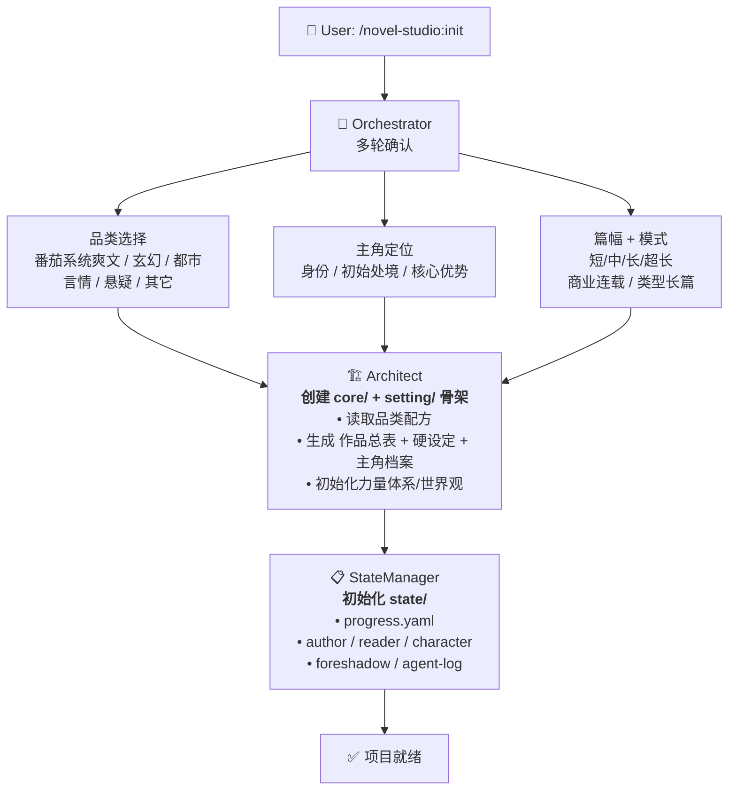

# init-project — 项目初始化 Workflow

## 状态机



## 详细步骤

### 步骤 1：Orchestrator 多轮确认

```
第一轮（必须）：
  Q1: 你想写什么品类？
      [番茄系统爽文 / 玄幻 / 都市 / 言情 / 悬疑 / 其它]

第二轮（必须）：
  Q2: 主角的初始定位是什么？
      身份：_____（如：普通高中生 / 落魄宗门弟子 / 都市白领）
      初始处境：_____（如：被退婚后觉醒 / 意外获得系统 / 重生回到过去）
      核心优势：_____（如：签到系统 / 前世记忆 / 隐藏血脉）

第三轮（可选，有默认值）：
  Q3: 预计篇幅？
      [短篇<50章 / 中篇50-200章 / 长篇200-500章 / 超长篇>500章]
      默认：长篇200-500章

  Q4: 写作模式？
      [商业连载 / 类型长篇]
      默认：商业连载

快速通道：
  如果用户一次性给出完整信息（「写一本番茄系统爽文，主角是穿越到修真界的高中生，靠签到系统崛起，计划写300章」）→ 直接确认并调度 Architect
```

### 步骤 2：Architect 创建工作区骨架

```
创建目录结构:
  my-novel/
  ├── core/
  ├── setting/
  │   ├── characters/
  │   ├── world/
  │   └── power-system/
  ├── outline/
  │   └── volumes/
  ├── chapters/
  ├── snippets/
  └── state/

创建文件:
  1. core/作品总表.md:
     - 书名：（由用户后续确定或 Architect 建议）
     - 品类：（用户选择）
     - 模式：（用户选择）
     - 篇幅：（用户选择）
     - 一句话概括：（根据 Architec 理解生成）
     - 读者承诺：（品类配方提供的核心体验承诺）

  2. setting/硬设定.yaml:
     - 从品类配方提取不可破坏规则
     - 从用户输入提取核心约束

  3. setting/characters/主角.yaml:
     - 按角色档案模板创建主角初始档案

  4. setting/power-system/:
     - 如果选择品类 → 按品类配方预设
     - 否则 → 创建空模板

  5. setting/world/:
     - 初始范围（品类配方或用户指定）
```

### 步骤 3：StateManager 初始化状态

```
创建 state/ 下所有文件:
  - progress.yaml: chapter=0, chapter_state.status=COMPLETED
  - author.yaml: 空模板
  - reader.yaml: 空模板
  - character.yaml: 从 setting/characters/ 导入
  - foreshadow.yaml: 空模板（stats全部=0）
  - agent-log.yaml: 首条记录 "project initialized"
```

## 输出

```
✅ 项目初始化完成！

📁 工作区已创建：
    - core/作品总表.md
    - setting/（硬设定 + 主角档案 + 世界观 + 力量体系）
    - outline/（待填充）
    - chapters/（待写作）
    - state/（运行时状态就绪）

🎯 下一步：
    /novel-studio:world  — 继续完善世界观和角色设定
    /novel-studio:write 1 — 直接开始写第一章
```
