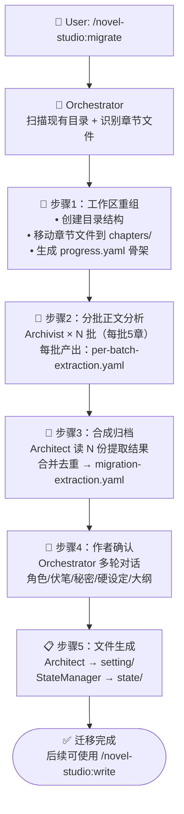

# migrate-project — 项目迁移 Workflow

## 状态机



## 触发条件

- 用户执行 `/novel-studio:migrate <现有目录路径>`
- Orchestrator 检测到当前目录不包含 `core/作品总表.md` 和 `state/progress.yaml`，但存在正文文件（`.md`/`.txt`）

---

## 步骤 1：工作区重组（Orchestrator 直接执行）

### 1.1 扫描现有目录

```
扫描逻辑：
  1. 列出目录下所有 .md / .txt 文件
  2. 按文件名推断章节编号：
     - 匹配 "第X章" / "Chapter X" / "chX" / 纯数字前缀
     - 无法推断编号的 → 按修改时间排序
  3. 统计总字数和章数
  4. 向用户展示扫描结果并确认
```

### 1.2 创建工作区

```
创建目录结构:
  my-novel/
  ├── core/
  ├── setting/
  │   ├── characters/
  │   ├── world/
  │   └── power-system/
  ├── outline/
  │   └── volumes/
  ├── chapters/
  ├── snippets/
  └── state/

移动章节文件:
  - 原文件 → chapters/第XXX章.md（统一命名）
  - 保留原文件备份（如用户要求）
```

### 1.3 生成 progress.yaml 骨架

```yaml
workspace:
  name: "待确认"
  genre: "待确认"
  mode: "商业连载"
  created: "2026-08-10"

current:
  chapter: <已完成的最后一章编号>
  volume: 1
  total_chapters_written: <扫描到的章数>
  total_words: <扫描到的总字数>
  last_updated: "2026-08-10"

chapter_state:
  chapter_number: <下一章编号>
  status: "COMPLETED"

files:
  book_core: "core/作品总表.md"
  hard_canon: "setting/硬设定.yaml"
  chapters_dir: "chapters/"
```

---

## 步骤 2：分批正文分析（Archivist × N）

### 分批策略

| 总章数 | 批数 | 每批章数 |
|--------|------|---------|
| ≤5 | 1 | 全部 |
| 6-20 | 2-4 | 5 |
| 21-50 | 5-10 | 5 |
| 51-100 | 11-20 | 5 |
| >100 | 每批 5 章 | 5 |

### MigrationBrief（Orchestrator → Archivist）

```yaml
migration_brief:
  from: Orchestrator
  to: Archivist
  batch: "3/10"                        # 第3批，共10批
  chapters:
    - path: "chapters/第011章-章节名.md"
      chapter_number: 11
    - path: "chapters/第012章-章节名.md"
      chapter_number: 12
    # ... 最多5章
  previous_batch_summary:               # 前一批的摘要（第一批为空）
    last_chapter: 10
    characters_so_far: ["主角", "配角A", "反派B"]
    active_thread_hints:                # 前批识别到的跨批线索
      - "玉佩发烫已在第3、5、8章出现"
```

`previous_batch_summary` 让 Archivist 在不跨批加载的前提下仍能感知连续性——知道前面出现过哪些角色和线索。

### 每批产出

Archivist 返回 `per-batch-extraction.yaml`（格式见 `agents/archivist.md`）。

Orchestrator 检查：
- 产出是否包含所有必填字段？
- 角色列表是否非空？
- 如有格式错误 → 重试 1 次

---

## 步骤 3：合成归档（Architect 执行）

### Architect 交接包

```yaml
architect_migration_brief:
  from: Orchestrator
  to: Architect
  total_batches: 10
  total_chapters: 50
  extraction_files:
    - "per-batch-extraction-batch-01.yaml"
    - "per-batch-extraction-batch-02.yaml"
    # ... 全部 N 份
```

### 合成操作

**角色去重合并**：
1. 按 `name` + `aliases` 交叉匹配，合并同角色的多批信息
2. 生成完整的 `abilities_shown` 时间线（按章排序）
3. 合并 `speech_pattern_hint`（取最详细的描述）
4. 推断角色定位：
   - 出场章号最早 + 每章都出现 → 主角
   - 有独立视角段落 → POV 配角
   - 出场 ≥3 章 → 配角
   - 出场 1-2 章 → 路人（可过滤）

**伏笔候选升级**：
1. 跨批匹配相同或高度相似的线索
2. 出现在 ≥3 章 → 确认为伏笔（`confirmed`）
3. 出现在 2 章 → 标记为 `likely`
4. 仅 1 章出现 → 标记为 `possible`，保留给作者判断

**硬设定合并**：
1. 同一规则在多批中的 evidence 合并
2. 输出候选硬设定清单（按 category 分组）

**关键事件时间线**：
1. 按章排序合并
2. 标记卷边界（如果事件密度/重要性出现明显断点）

**品类确认**：
1. 汇总各批的 `genre_signals`
2. 取 confidence 最高且 evidence 最多的品类

### 产出：migration-extraction.yaml

```yaml
migration_extraction:
  total_chapters: 50
  total_words: 125000
  genre: "系统爽文"
  genre_confidence: 0.85

  characters:
    - name: "主角"
      is_pov: true
      role: "主角"
      first_appearance: 1
      chapters_present: [1,2,3,...,50]
      abilities_timeline:
        - chapter: 1
          ability: "系统激活"
        - chapter: 3
          ability: "力量强化"
      speech_pattern: "简短，3-5字，极少用疑问句"
      key_traits: "谨慎，行动前观察环境；对系统半信半疑"
      extracted_notes: "正文中未说明动机和背景——需作者补充"

    - name: "配角A"
      is_pov: false
      role: "配角"
      first_appearance: 2
      chapters_present: [2,4,5,7,9,...]
      speech_pattern: "前后不一致——第2-10章简短，第15章后变啰嗦（可能有意设计）"

  foreshadow:
    confirmed:                        # 确认为伏笔（≥3章出现）
      - id: "thr-001"
        content: "玉佩在关键时刻发烫"
        chapters: [3,5,8,12,15]
        type: "物件"
        status: "active"
    likely:                           # 很可能是伏笔（2章出现）
      - id: "candidate-003"
        content: "配角A提到某个人时每次都转移话题"
        chapters: [7, 12]
    possible:                         # 可能是伏笔（1章出现但特征明显）
      - id: "candidate-005"
        content: "第20章出现的陌生老者——只出场一次但描写详细"

  hard_canon_candidates:
    - rule: "系统任务不可拒绝"
      category: "能力限制"
      evidence_count: 12

  event_timeline:
    - chapter: 1
      events: ["穿越", "系统激活", "第一个任务"]
    # ...

  open_questions:
    - "系统为什么选中主角？"
    - "配角A的真实立场是什么？"
```

---

## 步骤 4：作者确认（Orchestrator 多轮对话）

每轮确认都展示提取结果，作者可以直接通过/修改/补充。

### 第一轮：概览确认

```
📊 扫描完成：50章 / 125,000字

自动识别结果：
  👤 角色：12 个（主角1 / 主要配角4 / 次要角色7）
  🔮 伏笔候选：8 条（确认3条 / 疑似3条 / 待定2条）
  📜 硬设定候选：6 条
  🏷️ 品类信号：系统爽文（置信度 85%）
  ❓ 开放问题：5 个

是否大致正确？有无重大遗漏？
```

### 第二轮：角色确认

逐个展示主要角色（主角 + POV 配角），每个角色：

```
👤 主角：叶凡
  - 出场：第1-50章（全勤）
  - 能力成长：系统激活(1) → 力量强化(3) → 速度强化(12) → 第一次升级(25)
  - 说话方式：简短直接，3-5字
  - 性格特征：谨慎，对环境敏感

需要补充：
  1. 主角的深层动机是什么？（正文没写，只有你知道）
  2. 主角有什么绝对不能做的事？（硬设定约束）
  3. 主角不知道什么？（将来会揭示但现在蒙在鼓里的信息）
```

### 第三轮：伏笔确认

```
🔮 已识别的伏笔线索：

已确认（≥3章出现）：
  1. ✅ 玉佩发烫 → 出现在第3/5/8/12/15章 → 确认为伏笔？
  2. ✅ 系统偶尔发布看似无关的任务 → 出现在第5/12/18/25章 → 确认为伏笔？

疑似（2章出现）：
  3. ❓ 配角A提到某个人时每次都转移话题 → 第7/12章 → 是伏笔还是巧合？

待定（1章出现但特征明显）：
  4. ❓ 第20章的陌生老者 → 只出现一次但描写详细 → 后续会再出现吗？

有已经回收的伏笔吗？有哪些漏掉的伏笔？
```

### 第四轮：秘密确认

```
🤫 作者秘密（正文没写但你知道的）：

你计划在后续章节揭示什么秘密？
例如：系统的真正来源、角色的隐藏身份、世界的真相……
（自由输入，不需要可跳过）
```

### 第五轮：大纲确认

```
📋 选项：
  A. 我有大纲文件 → 告诉我在哪，我帮你导入
  B. 没有大纲 → 我根据已提取的50章事件线反推一个粗纲
  C. 不需要大纲 → 跳过，直接完成迁移
```

---

## 步骤 5：文件生成

### Architect 写入 setting/

收到作者确认后的 `migration-extraction.yaml`：

1. `core/作品总表.md`：书名（用户提供）+ 品类 + 模式 + 篇幅 + 一句话概括
2. `setting/硬设定.yaml`：从候选硬设定中筛选用户确认的规则
3. `setting/characters/主角.yaml`：按角色档案模板（从提取数据 + 作者补充填充）
4. `setting/characters/配角.yaml`：主要配角（POV 或出场 >10 章）
5. `setting/world/`：从事件中提取的地理/势力信息（如有）
6. `setting/power-system/`：从能力时间线反推的等级体系（如有）
7. `outline/全书总纲.md`：如有大纲导入

### StateManager 写入 state/

1. `progress.yaml`：更新为迁移完成状态（workspace 信息 + 当前进度）
2. `author.yaml`：作者确认的秘密列表
3. `reader.yaml`：已知事实 = 事件时间线摘要 + 开放问题
4. `character.yaml`：从 Architect 的角色档案导入 POV 角色的认知状态
5. `foreshadow.yaml`：作者确认的伏笔清单（已回收的标记为 resolved）
6. `agent-log.yaml`：记录迁移操作

---

## 输出

```
✅ 迁移完成！

📊 迁移结果：
   📁 章节：50章已重组到 chapters/
   👤 角色：12个角色已归档（主角1 / 配角4 / 次要角色7）
   🔮 伏笔：5条活跃 / 2条已回收（第25/30章）
   📜 硬设定：6条已确认
   🤫 作者秘密：3条已记录

🎯 下一步：
   /novel-studio:write 51  — 继续写下一章
   /novel-studio:world    — 补充设定
   /novel-studio:check 30 — 检查已写章节质量
```

---

## 错误处理

| 场景 | 处理 |
|------|------|
| 章节文件无法识别编号 | 按修改时间排序，请用户确认顺序 |
| 某批 Archivist 提取格式错误 | 重试 1 次，仍失败则跳过该批（标记为需人工处理） |
| Architect 合成发现角色矛盾 | 标注矛盾，在作者确认环节提出 |
| 作者中断确认流程 | 保存当前 migration-extraction.yaml，下次从断点继续 |
| 目录中混合了多个小说 | 按文件名聚类，让用户选择要迁移的哪部 |
