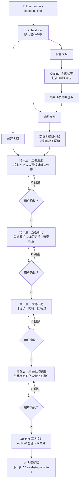

# outline — 大纲设计 Workflow

## 状态机



## 操作类型判断

Orchestrator 首先确认用户意图：

| 用户说 | 执行路径 |
|--------|---------|
| 「创建大纲」「从零开始」「设计大纲」 | 创建（四层递进） |
| 「调整第X卷」「改一下故事线」 | 调整（定位目标层） |
| 「检查大纲」「看看有什么问题」 | 检查（Outliner 全面扫描） |
| `/novel-studio:outline`（无参数） | 询问用户想做哪个 |

## 创建流程

### 第一层：全书总纲（3 轮对话）

**第 1 轮：核心冲突与主题**
```
Orchestrator 读取作品核心 + canon 摘要
问用户：核心冲突、最想让读者记住的事、绝对要写的场景
```

**第 2 轮：故事线拆解**
```
Orchestrator 基于用户回答 + canon，草拟故事线拆解方案：
- 主线 A + 支线 B（+ 支线 C 如果故事需要）
- 每条线：核心故事 + 主人公 + 赌注 + 预计收束卷

展示方案，用户修改/确认。
```

**第 3 轮：分卷规划**
```
Orchestrator 基于故事线，草拟分卷方案：
- 每卷：章节范围 + 功能 + 各故事线起止状态 + 卷末钩子

展示方案，用户修改/确认。
```

第一层确认后，Orchestrator 将确认的内容传递给 Outliner，生成全书总纲草稿。

### 第二层：逐卷细化（每卷 2-3 轮对话）

逐卷进行。以第一卷为例：

**第 1 轮：关键节拍**
```
问用户：主线A在这一卷最重要的 3-5 个节拍是什么？
用户回答后，Outliner 将其映射到章节位置。
```

**第 2 轮：故事线交错**
```
展示几条线在这一卷的交错方案：
- 哪几章主推A线，哪几章主推B线
- AB交汇的关键节点
- 给出 2-3 个交错方案选项
```

**第 3 轮：节奏检查**
```
Outliner 对每卷做节奏检查：
- 强度分布是否合理（不能连续高强度或连续过渡）
- 指出风险，用户确认或调整
```

### 第三层：伏笔布局（1-2 轮对话）

```
Outliner 基于已有的故事节拍，提出伏笔方向：
- 每个伏笔：埋设章/回收章/中间轻碰章/属于哪条线
- 每个伏笔服务于什么（角色成长/主题/剧情转折）

用户选择想要的方向，提出自己的想法。
```

### 第四层：角色弧光映射（1 轮对话）

```
Outliner 将角色弧光映射到剧情节拍上：
- 每卷的起点状态 → 催化剂事件 → 终点状态
- 检查弧光是否和节拍对齐

用户确认或调整。
```

## 调整流程

```
1. Orchestrator 确认调整目标层
2. 只加载受影响的文件（不重新加载全书大纲）
3. 在目标层内进行多轮纠偏对话
4. 修改完检查影响范围（比如改了故事线可能影响伏笔）
5. 用户确认后写入
```

## 检查流程

```
Outliner 执行 6 项检查：
1. 故事线完整性：每条线从埋下到收束，中间不消失
2. 线间平衡：是否有故事线超过 20 章未出现
3. 伏笔匹配：埋了的都收了吗，收了的都有埋吗
4. 节奏分布：是否有连续 5+ 章同强度
5. 卷尾钩子：每卷结尾是否有推动力
6. 角色弧光对齐：弧光变化是否有催化剂事件支撑

报告问题列表，用户决定修复哪些。
```

## Outliner 输出文件

```
outline/
├── 全书总纲.yaml          # 故事线/分卷/核心冲突/主题
├── 伏笔地图.yaml          # 所有伏笔的埋设和回收规划
├── 角色弧光.yaml          # 关键角色每卷状态变化
├── 故事线交错.yaml        # 章级别的主次线分配
└── volumes/
    ├── volume-01.yaml     # 每卷节拍/转折点/节奏/钩子
    ├── volume-02.yaml
    └── ...
```

## 核心原则

- **先粗后细**：全书总纲确认后再逐卷细化，不一步到位
- **每层确认**：不跳到下一层直到当前层用户满意
- **大纲是地图不是轨道**：实际写作中的好想法应纳入大纲而非被扼杀
- **调整最小影响**：改一处只检查相关连锁反应，不重写无关部分
