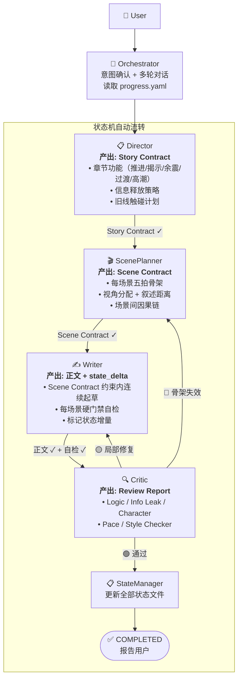
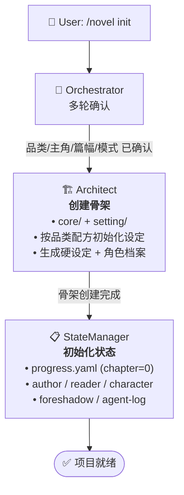
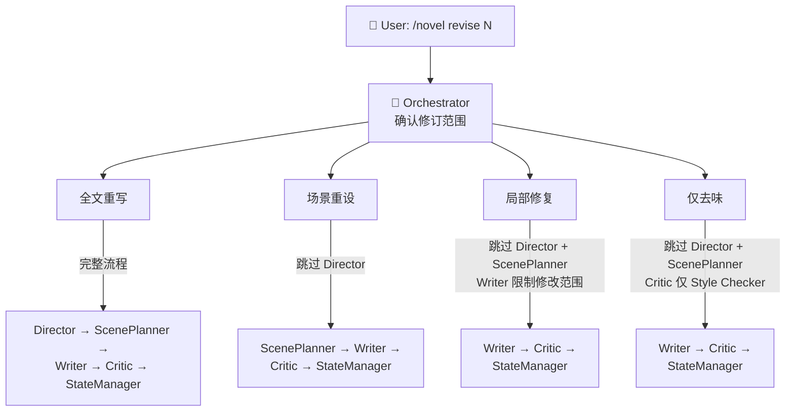
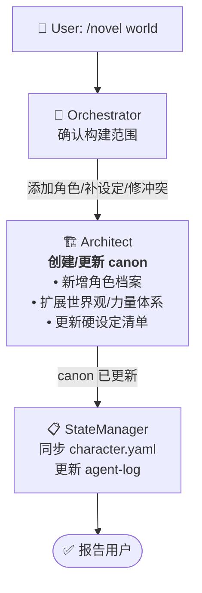
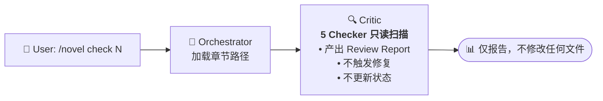
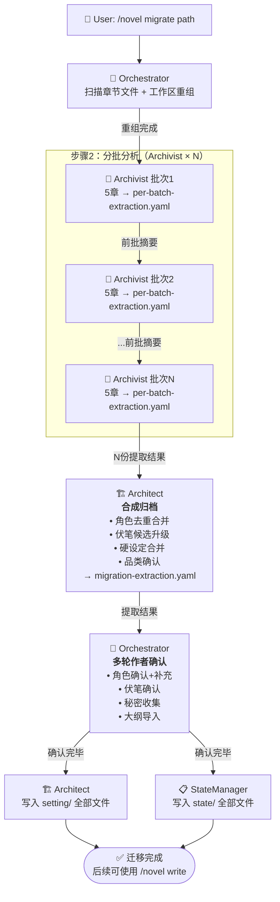

# 流水线定义

> 本文档是 novel-studio 所有 Agent 流水线的**唯一权威定义**。
> 每个 Agent 在自己的文件中引用本文档，不自行描述流水线位置。

---

## 一、写章节（write-chapter）

**触发**: `/novel write <N>` | `/novel write next`

**状态枚举**: NEED_PLAN → NEED_SCENE → NEED_DRAFT → NEED_REVIEW → COMPLETED

**交接包流转**:
| 步骤 | 交接包 |
|------|--------|
| Orchestrator → Director | DirectorBrief |
| Orchestrator → ScenePlanner | ScenePlannerBrief |
| Orchestrator → Writer | WriterBrief |
| Orchestrator → Critic | CriticBrief |
| Critic 通过 → StateManager | StateManagerBrief |

---

## 二、初始化项目（init-project）

**触发**: `/novel init`

---

## 三、修订章节（revise-chapter）

**触发**: `/novel revise <N>`

| 用户说 | 修订范围 | 跳过 |
|--------|---------|------|
| 「重写第X章」「全部重写」 | 全文重写 | 无 |
| 「节奏不对」「场景结构有问题」 | 场景重设 | Director |
| 「有几处写得不好」「对话修一下」 | 局部修复 | Director, ScenePlanner |
| 「AI味太重」「去味」 | 仅去味 | Director, ScenePlanner |

---

## 四、世界观构建（worldbuilding）

**触发**: `/novel world`

---

## 五、质量检查（novel-check）

**触发**: `/novel check <N>`

---

## 六、项目迁移（migrate-project）

**触发**: `/novel migrate <现有目录路径>`

详见 [`workflows/migrate-project.md`](migrate-project.md)。

---

## Agent ↔ 流水线对应关系

| Agent | 出现在流水线 |
|-------|-------------|
| Orchestrator | 全部六条 |
| Architect | 初始化、世界观构建、项目迁移（合成归档） |
| Archivist | 项目迁移（分批分析）——迁移完成后不再使用 |
| Director | 写章节（修订-全文重写） |
| ScenePlanner | 写章节、修订（全文重写/场景重设） |
| Writer | 写章节、修订（全部四种范围） |
| Critic | 写章节、修订（全部四种范围）、质量检查 |
| StateManager | 写章节、初始化、修订、世界观构建、项目迁移（文件生成） |

---

## 关键约束

1. **Agent 不自选后继**: 下一步由状态机决定，不由 Agent 推荐
2. **Orchestrator 是唯一中转站**: Agent 之间不直接通信，所有信息经 Orchestrator 传递
3. **StateManager 是唯一写入口**: 其他 Agent 只标记增量，不直接写 `state/` 文件
4. **Writer 不读大纲**: 渐进披露，Writer 只知道 Scene Contract 和禁止触碰清单
5. **交接包裁剪**: Orchestrator 按 `runtime/handoff-schema.md` 裁剪交接包，下游 Agent 只收到所需字段

---

## 交接包类型对照

每条流水线的 Agent 间传递使用专属交接包格式：

| 流转 | 交接包类型 | 说明 |
|------|-----------|------|
| Orchestrator → Director | DirectorBrief | 状态摘要（非完整状态文件） |
| Orchestrator → ScenePlanner | ScenePlannerBrief | 完整 Story Contract + 结构信息 |
| Orchestrator → Writer | WriterBrief | scenes/five_beats + 约束 + 章尾落点 |
| Orchestrator → Critic | CriticBrief | 合并检查清单（forbid_touch + canon + pov） |
| Orchestrator → StateManager | StateManagerBrief | Review Report + state_delta |
| Orchestrator → Architect | 直接传递用户构想 | 不使用 Brief 格式（仅 init/worldbuilding） |
| Orchestrator → Archivist | MigrationBrief | 批次章节列表 + 前批摘要 |
| Orchestrator → Architect（迁移合成） | ArchitectMigrationBrief | N 份 per-batch-extraction.yaml 路径列表 |

完整字段定义见 `runtime/handoff-schema.md`。
