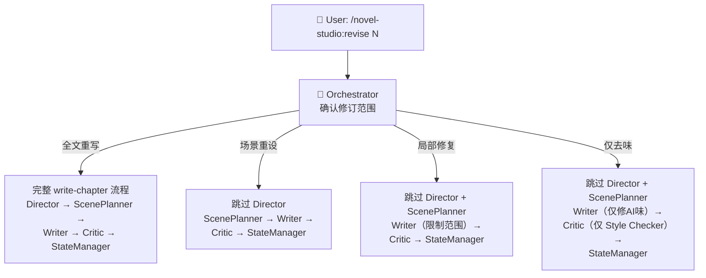
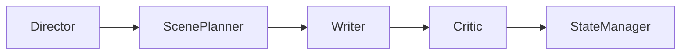
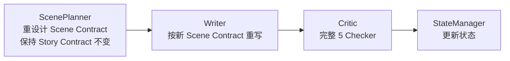
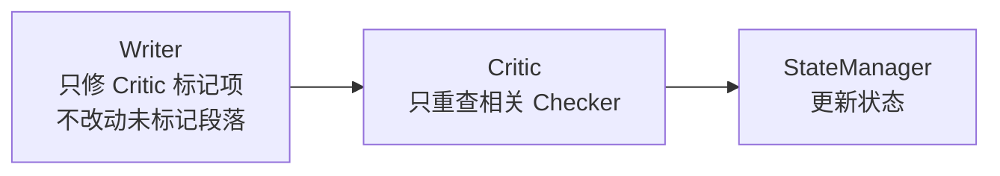
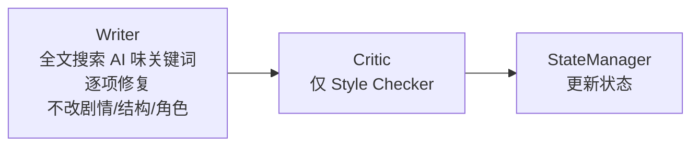

# revise-chapter — 章节修订 Workflow

## 状态机



## 修订范围判断

Orchestrator 通过多轮确认判断修订范围：

| 用户说 | 修订范围 | 跳过 |
|--------|---------|------|
| 「重写第X章」「全部重写」 | 全文重写 | 无 |
| 「第X章节奏不对」「场景结构有问题」 | 场景重设 | Director |
| 「有几处写得不好」「对话修一下」 | 局部修复 | Director, ScenePlanner |
| 「AI味太重」「去味」 | 仅去味 | Director, ScenePlanner |

## 各修订范围流程

### 全文重写



（等同于 write-chapter，不优化）

### 场景重设



### 局部修复



Writer 在局部修复模式的约束：
- 不改动未标记的场景和段落
- 修复后保持前后文的连贯性
- 如果修复牵涉超过 30% 的正文 → 升级为场景重设

### 仅去味



## 强制规则

1. **修订后的字数波动不超过 20%**（除非用户要求扩写/缩写）
2. **修订不能改变章节的硬设定**（不能突然改了力量等级或角色关系）
3. **修订不能新增未在 Story Contract 中允许的信息**
4. **如果修复引发新的硬伤 → 升级修订范围**

## 用户可见输出

```
🔧 正在修订第10章（局部修复：3处对话 + 2处AI味）

📝 修复完成：
   ✅ 场景2对话：增加了主角和被救者之间的张力
   ✅ 场景3结尾：删除了「在这一刻」等AI味表达
   ✅ 5处修改，字数变化 +120 字（<5%）

🔍 复查中…
✅ 修复项全部通过，无新增问题
```
