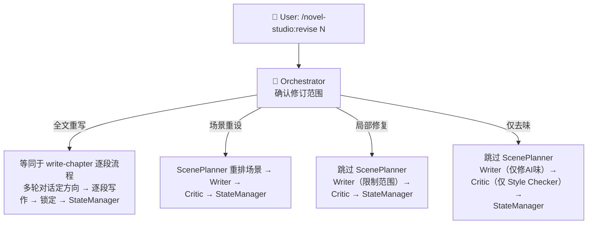
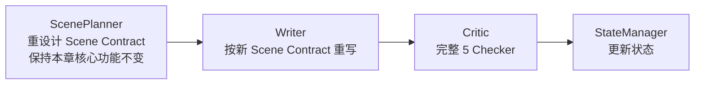
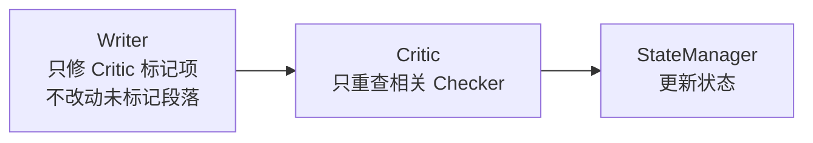
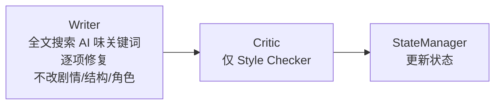

# revise-chapter — 章节修订 Workflow

## 状态机



## 修订范围判断

Orchestrator 通过多轮对话判断修订范围。**先问用户觉得哪里不对，再判断范围并告知用户，确认后执行。**

```
1. 了解问题：
   问用户：「你想改什么？」——用开放式问题，不预设选项。
   
2. 判断范围（Orchestrator 内部决策）：
   根据用户描述判断属于哪种范围。
   告知用户：「我的判断是 [范围]，因为 [原因]。这个范围意味着会动X，不会动Y。可以吗？」
   
3. 用户确认后执行。
   如果修复过程中发现小范围不够 → 告知用户并建议升级，等待确认。
```

| 用户描述 | 修订范围 | 流程 | 说明 |
|---------|---------|------|------|
| 「重写第X章」「全部重写」 | 全文重写 | 等同 write-chapter 逐段 | 多轮对话定方向 + 逐段写作 |
| 「第X章节奏不对」「场景结构有问题」 | 场景重设 | ScenePlanner → Writer → Critic | 重排场景结构，保持核心功能不变 |
| 「有几处写得不好」「对话修一下」 | 局部修复 | Writer → Critic（跳过 ScenePlanner） | 只改标记位置，不动其他 |
| 「AI味太重」「去味」 | 仅去味 | Writer → Critic 仅 Style（跳过 ScenePlanner） | 只修AI味关键词，不动剧情结构 |

## 各修订范围流程

### 全文重写

（等同于 write-chapter 逐段流程，详见 `write-chapter.md`）

### 场景重设



### 局部修复



Writer 在局部修复模式的约束：
- 不改动未标记的场景和段落
- 修复后保持前后文的连贯性
- 如果修复牵涉超过 30% 的正文 → 升级为场景重设

### 仅去味



## 强制规则

1. **修订后的字数波动不超过 20%**（除非用户要求扩写/缩写）
2. **修订不能改变章节的硬规则**（不能突然改了力量等级或角色关系，也不能改变系统面板的字段/标题/格式——面板以 `setting/系统面板.md` 为准）
3. **修订不能新增未在 forbid_touch 之外授权的信息**（信息释放由用户方向讨论确定）
4. **如果修复引发新的硬伤 → 升级修订范围**

## 反模式（禁止）

- 用户说了不满意的点，却跑全量检查然后按检查报告改——先问清用户想改什么
- 小修小补的问题却建议全文重写——按修订范围判断，不擅自升级
- 修改范围超出用户授权——用户说修对话，就只修对话，不顺手改剧情
- 不告知用户就升级修订范围——升级前必须说明原因并等待确认

## 用户可见输出

```
🔧 正在修订第10章（局部修复：3处对话 + 2处AI味）

📝 修复完成：
   ✅ 场景2对话：增加了主角和被救者之间的张力
   ✅ 场景3结尾：删除了「在这一刻」等AI味表达
   ✅ 5处修改，字数变化 +120 字（<5%）

🔍 复查中…
✅ 修复项全部通过，无新增问题
```
