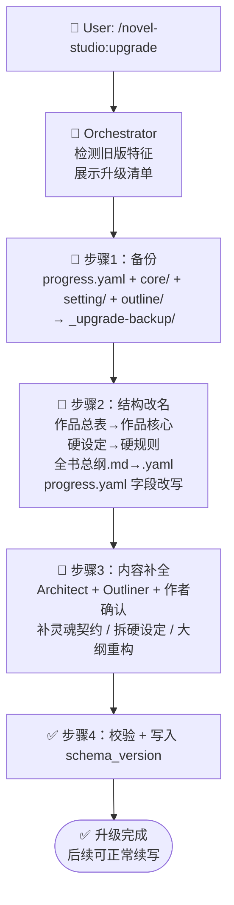

# upgrade-project — 工作区升级 Workflow

## 状态机



## 触发条件

- 用户执行 `/novel-studio:upgrade`
- Orchestrator 检测到：`core/作品总表.md`（旧名）存在，且 `state/progress.yaml` 缺失 `schema_version` 字段（或 `files` 块使用旧字段 `hard_canon`、`files.outline` 指向 `.md`）

---

## 步骤 0：检测与确认（Orchestrator）

检测旧版特征（任一即判定 v2）：

```
1. core/作品总表.md 存在（新版应叫 core/作品核心.md）
2. setting/硬设定.yaml 存在（新版应叫 setting/硬规则.yaml）
3. progress.yaml 的 files 块含 hard_canon 字段（新版叫 hard_rules）
4. progress.yaml 缺失 schema_version 字段
5. progress.yaml 的 files.outline 指向 .md（新版是 outline/全书总纲.yaml）
```

向用户展示升级清单并确认：

```
🔍 检测到旧版工作区（v2），需升级到当前 v3 结构。

升级将执行：
  📝 core/作品总表.md  → core/作品核心.md（重组织为灵魂契约）
  📝 setting/硬设定.yaml → setting/硬规则.yaml（力量等级/身份拆出）
  📝 outline/全书总纲.md → outline/全书总纲.yaml（主线/支线重构为角色故事线）
  🔧 progress.yaml 字段 hard_canon → hard_rules，补 chapter_word_target、schema_version
  🔒 state/ 下 author/reader/character/foreshadow 一律保留，不重扫正文

是否继续？（升级前会先备份，可回滚）
```

---

## 步骤 1：备份（Orchestrator 直接执行）

升级前把将被改动的文件快照到工作区根目录 `_upgrade-backup/`：

```
_backup 内容:
  _upgrade-backup/
  ├── progress.yaml           # 旧 progress.yaml 原样
  ├── core/作品总表.md         # 旧 core 原样
  ├── setting/硬设定.yaml      # 旧硬设定原样
  ├── outline/全书总纲.md       # 旧大纲原样
  └── MANIFEST.md             # 记录升级前 schema_version（若无则标注 v2）+ 备份时间
```

原则：备份**只读、不改动**。升级失败时按 MANIFEST.md 原样恢复。

---

## 步骤 2：结构改名（Orchestrator 直接执行）

### 2.1 文件改名

| 旧路径 | 新路径 |
|--------|--------|
| `core/作品总表.md` | `core/作品核心.md` |
| `setting/硬设定.yaml` | `setting/硬规则.yaml` |
| `outline/全书总纲.md` | `outline/全书总纲.yaml` |

### 2.2 重写 progress.yaml 字段

```yaml
# 改动点（保留其它所有字段与值不变）
schema_version: 3                        # 新增
workspace:
  chapter_word_target: 2000              # 新增（若缺失；用户可改）
files:
  book_core: "core/作品核心.md"           # 路径更新
  hard_rules: "setting/硬规则.yaml"       # 字段名 hard_canon → hard_rules + 路径更新
  outline: "outline/全书总纲.yaml"         # 路径更新（.md → .yaml，内容由步骤 3.3 重构）
  # hard_canon 字段删除（旧值已迁移到 hard_rules）
```

**不动的部分**：`workspace.name/genre/mode/created`、`current.*`、`chapter_state.*`、`next_milestone.*`、`files.volumes/chapters_dir` 全部原样保留。

---

## 步骤 3：内容补全（Architect + Outliner + 作者确认）

### 3.1 core 灵魂契约重组织

旧「作品总表」的表格内容 → 新版「作品核心」6 字段。Architect 读旧内容，能直接映射的字段直接填入，缺失字段**标注「待作者补充」**，不杜撰：

| 新版字段 | 来源 |
|---------|------|
| 一句话概括 | 旧总表 logline（若有） |
| 读者承诺 | 旧总表 读者承诺/爽点（若有） |
| 基调 | 旧总表 基调（若有），否则待补充 |
| 主角内核 | 旧总表 主角内核（若有） |
| 主线承诺 | 旧总表 主线承诺（若有） |
| 禁忌与红线 | 旧总表若有则迁移；通常缺失 → 待作者补充 |

**元信息（书名/品类/模式/篇幅）不写进 core**——本就在 `progress.yaml` 的 `workspace` 块里，无需迁移。

对缺失字段，逐项向作者确认（每轮最多 3 项）：

```
📝 core 灵魂契约补全：

已自动迁移：
  ✅ 一句话概括：<旧总表内容>
  ✅ 主线承诺：<旧总表内容>

待你补充（旧版没有这些字段）：
  1. 基调（全书情绪底色）？
  2. 禁忌与红线（坚决不写什么）？
```

### 3.2 硬设定拆分

Architect 读旧 `硬设定.yaml`，把条目归位：

| 旧硬设定条目类型 | 去向 |
|-----------------|------|
| 力量等级（境界体系） | `setting/power-system/`（新建对应文件） |
| 主角初始身份/身份约束 | `setting/characters/主角.yaml` 的 `constraints` |
| 系统规则、跨主题全局约束 | 留在 `setting/硬规则.yaml` |

拆分时向作者确认哪些条目属于力量等级/身份（因为旧硬设定是混在一起的清单，需作者判定归类），不确定的条目**保留在硬规则.yaml 里并标注「待归类」**，不强行拆分。

### 3.3 outline 重构（Outliner）

旧版大纲是 `outline/全书总纲.md`（主线/支线结构），新版是 `outline/全书总纲.yaml`（角色故事线 + 卷级规划，见 `agents/outliner.md`）。Outliner 读旧 MD 大纲内容，重构为新结构：

| 旧大纲内容 | 新版去向 |
|-----------|---------|
| 主线 | 主角故事线 `sl-001` |
| 各支线 | 对应角色的故事线 `sl-00X`（只服务主角、无独立走向的配角不单列） |
| 分卷 | `outline/volumes/volume-NN.yaml` 的卷功能/章节范围 |
| 伏笔 | `outline/伏笔地图.yaml`（能映射的映射） |

无法自动映射的部分**标注「待 Outliner 细化」**，不杜撰。大纲重构是创作决策（角色故事线拆分、卷级规划），逐项向作者确认，与 core 灵魂契约补全同理；不确定的保留旧大纲内容作为参考，不强行重构。

### 3.4 state/ 大文件

**一律不动**。`author.yaml` / `reader.yaml` / `character.yaml` / `foreshadow.yaml` / `agent-log.yaml` 保留原样——它们是续写的宝贵上下文，字段名未变，无需迁移。

> 唯一例外：若 `character.yaml` 中角色的 `current_state.level` 引用了旧力量等级名，而步骤 3.2 重新命名了等级体系 → 由作者确认是否同步改名（默认不改，只提醒）。

---

## 步骤 4：校验与收尾（StateManager）

升级完成后校验：

```
1. core/作品核心.md 存在，且 6 字段齐全（缺失项已明确标注「待补充」）
2. setting/硬规则.yaml 存在，力量等级/身份条目已归位
3. outline/全书总纲.yaml 存在，角色故事线已重构（无法映射的标注「待 Outliner 细化」）
4. progress.yaml 含 schema_version: 3、files.hard_rules、files.outline（指向 .yaml）、workspace.chapter_word_target
5. state/ 下 5 个大文件原样存在，未被改动
6. 无残留旧路径（grep 无 作品总表 / 硬设定 / hard_canon / 全书总纲.md）
```

校验通过 → StateManager 写 `agent-log.yaml` 一条 `upgrade v2→v3 completed` 记录。

输出：

```
✅ 升级完成！

📁 已变更：
   core/作品总表.md  → core/作品核心.md（灵魂契约，缺字段已标注）
   setting/硬设定.yaml → setting/硬规则.yaml（力量/身份已拆出）
   outline/全书总纲.md → outline/全书总纲.yaml（角色故事线，待细化已标注）
   progress.yaml → 字段改写 + schema_version: 3

🔒 已保留：
   state/ 下全部状态文件（角色/读者/伏笔/作者秘密未动）

💾 备份位置：_upgrade-backup/（确认无误后可删除）

🎯 下一步：
   /novel-studio:write  — 继续写下一章
   /novel-studio:world  — 补全「待补充」字段
```

---

## 错误处理

| 场景 | 处理 |
|------|------|
| 备份失败（目录不可写） | 中止升级，报告用户，不执行任何改名 |
| 改名中途失败 | 从 `_upgrade-backup/` 恢复，报告用户 |
| 旧作品总表内容无法解析 | 保留原文件，core 新建空灵魂契约框架，逐项请作者口述补充 |
| 硬设定条目无法归类 | 保留在硬规则.yaml 并标注「待归类」，不强行拆分 |
| 旧大纲内容无法解析/映射 | 保留旧 MD 大纲内容作为参考，新建 YAML 框架，标注「待 Outliner 细化」，不强行重构 |
| 作者中断内容补全 | 已完成的改名保留，缺失字段标注「待补充」，下次 `/novel-studio:upgrade` 从步骤 3 继续 |

## 反模式（禁止）

- ❌ 重扫正文重建 state/（丢失续写上下文）
- ❌ 杜撰旧作品总表里没有的灵魂契约字段
- ❌ 强行拆分无法归类的硬设定条目
- ❌ 把旧主线/支线大纲机械改名成 YAML 而不重构内容（旧结构不匹配新版）
- ❌ 杜撰旧大纲里没有的故事线
- ❌ 不备份直接改名（不可回滚）
