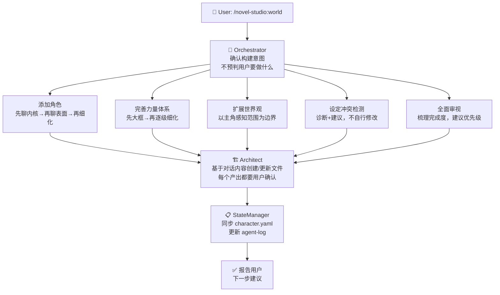

# worldbuilding — 世界观构建 Workflow

## 状态机



## 详细步骤

### 入口：Orchestrator 确认意图

```
不预设选项，问开放问题：
  🌍 你想做什么？
  （用户可能说：加角色、完善力量体系、补世界观、检查冲突、看看缺什么）

不预判——听用户说什么就是什么。
```

### 分支 A：添加角色

**核心原则**：不让用户填表。通过对话逐步收敛。

```
Phase 1 — 故事功能：
  这个人在你的故事里是干嘛的？
  和主角是什么关系？
  最重要的一件事是什么？

Phase 2 — 外在/内在反差：
  表面上别人看到的他/她是什么样？
  实际上内心是什么样的？
  两者之间有什么反差？

Phase 3 — 说话方式：
  怎么说话？有什么口头禅或语言习惯？
  不擅长或害怕什么？

Phase 4 — 关系定位：
  和已有角色的核心冲突是什么？
  [列出已有角色名供参考]

Phase 5 — 整理确认：
  基于以上对话，整理设计大纲，让用户确认。
  指出潜在的设定冲突。只有用户确认后才创建文件。

Phase 6 — 写入文件：
  Architect 基于对话内容创建角色档案。
  更新关联角色的 relationships。
  标注不确定项为「待确认」。
```

### 分支 B：完善力量体系

**核心原则**：先大框后细化。用户说停就停。

```
Phase 1 — 确认现状和方向：
  当前力量体系状态 [报告已有内容]。
  你想从哪个方面入手？
  （等级划分 / 能力类型 / 社会影响 / 限制代价 / 其他）

Phase 2 — 大框架：
  先确认大框架——用户脑子里的大等级和跃升方式。
  不用太细，画大框就行。

Phase 3 — 逐级细化（可选）：
  用户确认大框架后，逐一细化。
  用户说停就停，剩下的标记「待细化」。

Phase 4 — 整理确认 → 写入文件。
```

### 分支 C：扩展世界观

**核心原则**：从主角感知范围出发，不写百科全书。

```
Phase 1 — 确认维度：
  地理 / 势力 / 历史 / 文化规则 / 其他
  从主角当前位置出发还是从特定位置？

Phase 2 — 按维度深入：
  每次只做一个维度。
  保持"主角能感知到"的边界。

Phase 3 — 整理确认 → 写入文件。
```

### 分支 D：设定冲突检测

```
1. 读取全部硬设定 + 角色档案
2. 逐条检查矛盾：能力/关系/时间线/等级
3. 发现冲突 → 标注 + 建议修复方案 → 用户决定
4. 不自行修改任何设定
```

### 分支 E：全面审视

```
1. 按维度梳理完成度：角色/力量体系/世界观/势力/历史
2. 指出最薄弱的一环 + 建议优先级
3. 用户决定先补哪个方向
```

## 渐进原则

- **最小可用**：只创建当前卷需要的设定
- **主角中心**：世界观从主角的感知范围出发
- **可推翻**：未在正文中出现的设定标注「未锁定」
- **已锁定不可改**：正文中已出现的设定，修改需评估影响

## 反模式（禁止）

- ❌ 用户说「加个角色」就生成完整的姓名/年龄/外貌/等级/背景故事
- ❌ 一次性抛出「请填写以下 8 项角色信息」
- ❌ 世界观扩展时从宇宙起源开始写
- ❌ 检测到设定冲突后自行修改
- ❌ 在用户没要求的情况下过度生成
