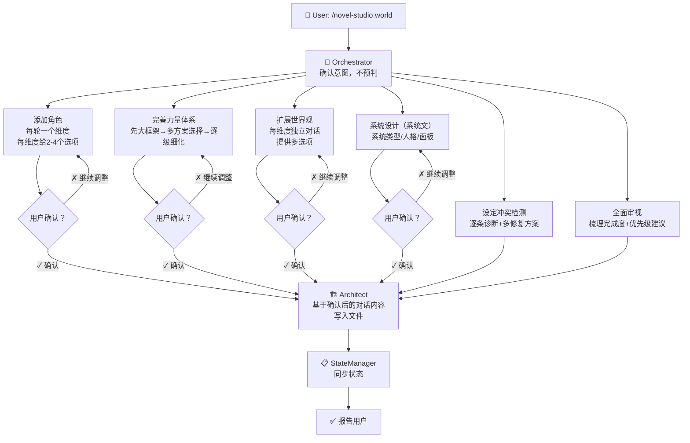

# worldbuilding — 世界观构建 Workflow

## 状态机



## 核心模式：一设定一对话

每个设定元素（一个角色、一条规则、一个势力）都是一场独立的多轮对话。每轮遵循：

```
1. 聚焦一个维度（不问复合问题）
2. 提供 2-4 个差异化选项 + 用户可自定义
3. 用户选择/输入
4. 复述理解，进入下一维度
5. 所有维度聊完后，整体确认
6. 用户不满意 → 回到任何维度重新调整
7. 用户满意 → 写入文件
```

## 分支 A：添加角色（6+ 轮）

> 本分支也服务于写作中发现的角色：write-chapter 中若需引入新重要配角（非一次性路人），Orchestrator 暂停写作并复用此分支完成设定。

### 第 1 轮：故事功能
```
这个人在故事里是干嘛的？
- 推动什么？制造什么麻烦？提供什么帮助？
- 没有这个人，故事会少了什么？
```

### 第 2 轮：核心矛盾
```
这个人的核心矛盾是什么？
提供 2-3 个选项 + 自定义。
```

### 第 3 轮：外表与第一印象
```
别人第一次见到会注意到什么？
提供 3 个选项（不同风格）+ 自定义。
```

### 第 4 轮：说话方式
```
怎么说话？有什么语言习惯？
提供 3 个选项，每个带示例对话 + 自定义。
```

### 第 5 轮：与已有角色的关系
```
和主角/其他已有角色的关系？
列出已有角色名，提供 2 个关系设定方案 + 自定义。
```

### 第 6 轮：整体确认
```
整理完整角色画像，逐项确认。
有冲突则指出。
用户可调整任何一项，重新确认。
```

## 分支 B：力量体系

### 例：等级划分
```
第 1 轮：确认大框架（几级、怎么升、有天花板吗）
第 2 轮：基于用户框架，提供 2-3 个完整体系方案
第 3+ 轮：逐级细化，每级给 2-3 个能力/限制/地位选项
用户随时可以说停，剩下的标注「待细化」
```

> 力量体系确定后，同步更新 `setting/系统面板.md`（若存在）：属性种类（力量/敏捷/精神/神识等）、等级名称、难度取值。保证个人信息面板、任务面板的字段与力量体系一致。

## 分支 C：扩展世界观

```
每维度独立对话：
第 1 轮：确认维度方向，提供 2-3 个选项
第 2+ 轮：逐层细化，始终提供多选项
```

## 分支 D：设定冲突检测

```
逐条列出冲突，每条附带 2-3 个修复方案。
用户选择后写入。
```

## 分支 E：全面审视

```
按维度梳理完成度，指出最薄弱环节。
建议优先级，用户决定。
```

## 分支 F：系统设计（系统文专属）

系统文除力量体系外，还需设计系统本身。每维度独立对话 + 多选项。

### 第 1 轮：系统类型
```
主线是任务流、签到流、抽奖流还是商城流？综合还是单一？
提供 2-3 个方案 + 自定义。
```

### 第 2 轮：系统人格
```
系统说话是什么口吻？高冷/吐槽/引导型/无感情播报？
提供 2-3 个选项，每个带示例台词。
```

### 第 3 轮：核心面板与字段
```
基于系统类型，列出本书剧情会出现的面板，逐面板确认字段。
提供面板清单，用户勾选/增删，锁定后不再随意增改。
```

> 面板确定后，同步更新 `setting/系统面板.md`：面板清单（本书启用哪几个面板）、字段命名、标题叫法、难度取值。锁定后全书统一，写作/检查/校正都以此为准。

## 渐进原则

- **最小可用**：只创建当前卷需要的设定
- **主角中心**：世界观从主角感知范围出发
- **可推翻**：未在正文中出现的设定标注「未锁定」
- **已锁定不可改**：正文中已出现的设定，修改需评估影响

## 反模式（禁止）

- ❌ 不给选项直接生成并写入
- ❌ 选项没有真正差异化（全是一个方向的不同措辞）
- ❌ 聊了两轮就觉得够了
- ❌ 用户选了一个选项你就把所有细节自己填了
- ❌ 在用户没要求的情况下过度生成
