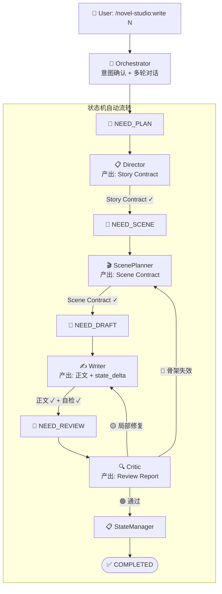
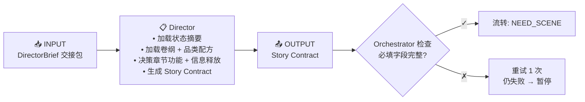
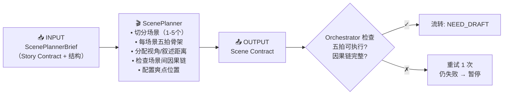
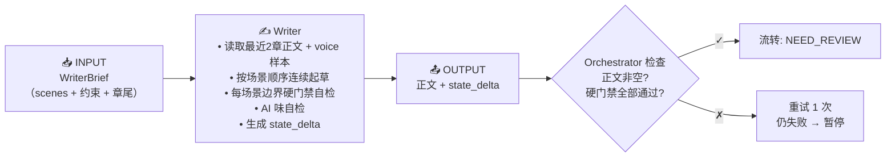
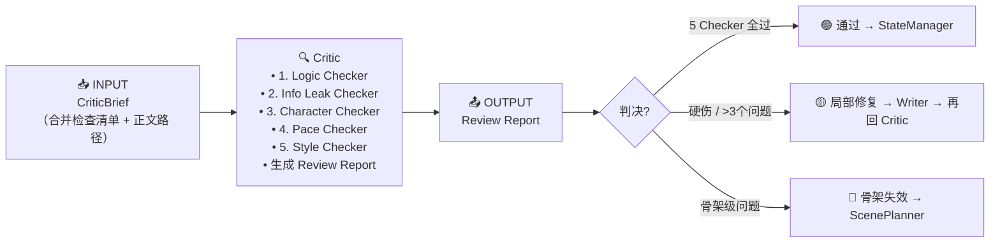
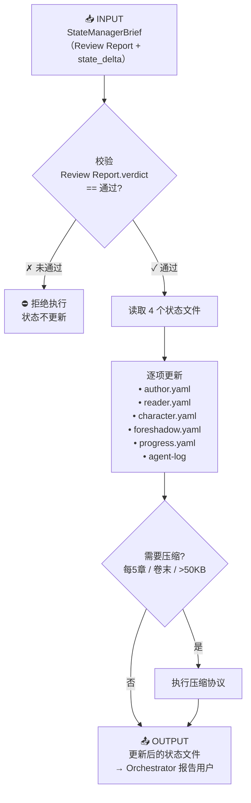
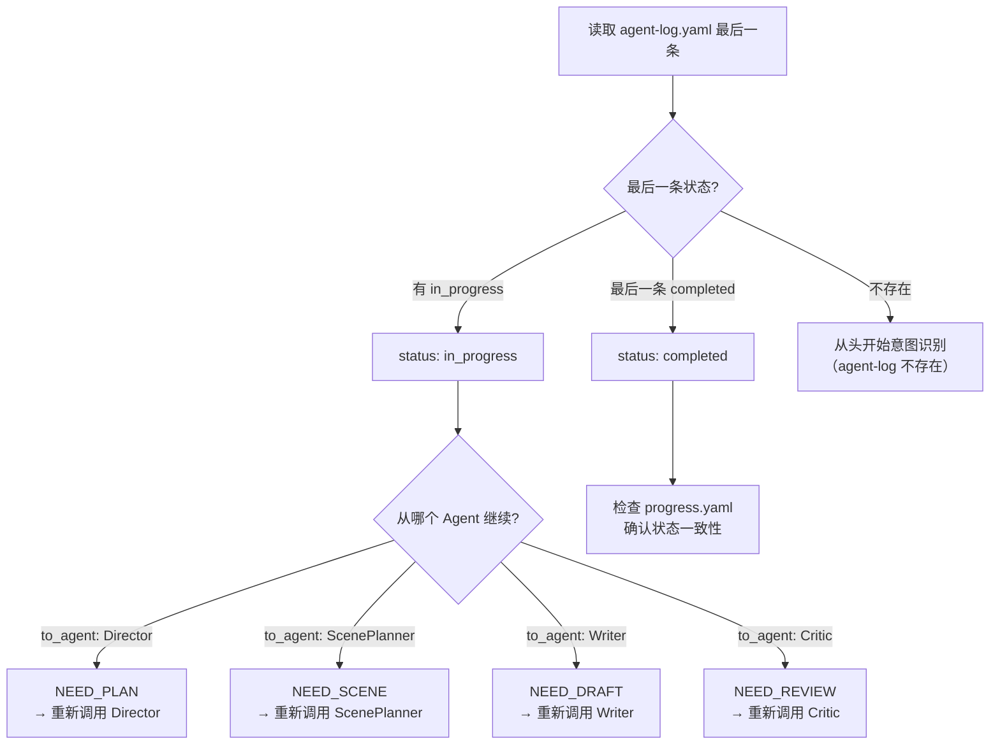

# write-chapter — 章节写作 Workflow

## 状态机



## 状态定义

| 状态 | 含义 | 触发条件 | 下一个 Agent |
|------|------|---------|-------------|
| NEED_PLAN | 缺少本章 Story Contract | progress.yaml chapter_state.status == NEED_PLAN | Director |
| NEED_SCENE | 缺少 Scene Contract | progress.yaml chapter_state.status == NEED_SCENE | ScenePlanner |
| NEED_DRAFT | 缺少正文 | progress.yaml chapter_state.status == NEED_DRAFT | Writer |
| NEED_REVIEW | 正文已有未验收 | progress.yaml chapter_state.status == NEED_REVIEW | Critic |
| COMPLETED | 验收通过+状态已更新 | progress.yaml chapter_state.status == COMPLETED | — |

## 详细流转步骤

### 步骤 1：Orchestrator 入口

```
INPUT: 用户指令 "/novel-studio:write 11"

ORCHESTRATOR 动作:
  1. 读取 progress.yaml
  2. 如果 chapter_state 已有状态（断点恢复）→ 从该状态继续
  3. 如果是新章节:
     - 计算下一章号（current.chapter + 1）
     - 多轮确认本章方向（1-2个问题）
     - 写入 progress.yaml: chapter_state = NEED_PLAN
  4. 生成交接包 → 传递给 Director
```

### 步骤 2：Director 执行（NEED_PLAN）



### 步骤 3：Scene Planner 执行（NEED_SCENE）



### 步骤 4：Writer 执行（NEED_DRAFT）



### 步骤 5：Critic 执行（NEED_REVIEW）



### 步骤 6：State Manager 执行（Critic 通过后）



## 错误处理矩阵

| 失败位置 | 错误类型 | 处理 |
|---------|---------|------|
| Director | Story Contract 不完整 | 重试 1 次，仍失败暂停并报告用户 |
| ScenePlanner | 五拍骨架不可执行 | 重试 1 次，仍失败暂停并报告用户 |
| Writer | 硬门禁未通过 | 回 Writer 修复（不重跑 Director/ScenePlanner） |
| Writer | 卡文无法继续 | 暂停并报告用户 |
| Critic | 局部修复 | 回 Writer（限制修改范围），修完再回 Critic |
| Critic | 骨架失效 | 回 ScenePlanner（重设计），不重跑 Director |
| Critic | 大面积信息泄漏 | 回 Director（重新设计信息释放策略） |
| StateManager | 状态更新失败 | 重试 1 次，仍失败保留 state_delta 待手动处理 |

## 断点恢复

当 Orchestrator 启动时检测到 `chapter_state.status` 不是 COMPLETED：



## 用户可见的输出

Orchestrator 在每一步向用户报告进度（不暴露 Agent 名）：

```
✍️ 正在规划第11章的故事方向…
✅ 章节方向已确定（推进：主角首次使用新能力）

🎬 正在设计场景结构…
✅ 3 个场景已编排完成

📝 正在写作中…
✅ 第11章完成（2500字）

🔍 正在质量检查…
✅ 检查通过（AI味 2处已自动修复，无硬伤）

📋 状态已更新 → 第11章完结
```
