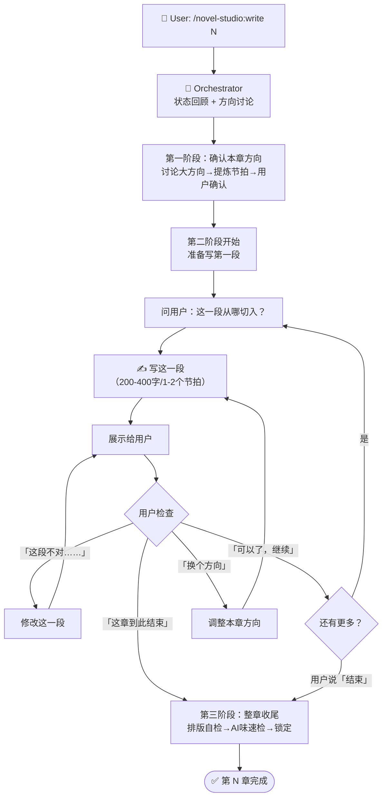

# write-chapter — 章节写作 Workflow

## 状态机



## 核心变化（与旧版对比）

| 维度 | 旧版（自动流转） | 新版（逐段协作） |
|------|----------------|----------------|
| Director | 自动生成 Story Contract | 由用户对话替代（方向讨论即 Story Contract） |
| ScenePlanner | 自动切分场景五拍 | 由用户对话替代（每段前用户描述想看什么） |
| Writer | 一次性写完整章 | 逐段写，每段 200-400 字，写完就停 |
| Critic | 写完后的全量检查 | 收尾阶段的轻量排版/格式检查 |
| 用户参与 | 仅方向选择时参与 | 每段都参与——描述方向、检查、纠偏 |

## 详细步骤

### 第一阶段：确认本章方向（3-5 轮对话）

```
1. Orchestrator 报告当前故事状态：
   - 上一章发生了什么
   - 主角处境
   - 活跃伏笔
   - 读者最关心的问题
   - 章尾情绪

2. 问用户：「这一章有没有特别想写的场景、对话、或感觉？」
   用户描述 → 基于用户描述提炼本章大方向
   用户没想法 → 基于故事状态给出 2-3 个方向供选择

3. 提炼为本章大纲：
   - [本章方向：一句话]
   - [节拍 1] → [节拍 2] → [节拍 3] → [章尾落点]
   - 预估字数 + 分段数

4. 用户确认方向（或调整）。
   确认后，不启动自动流水线——直接进入逐段写作。
```

### 第二阶段：逐段写作（核心流程，每段重复）

```
每段流程（4 步循环）：

STEP 1 — 用户触发：
  - 用户描述这一段想看到什么，或
  - 用户说「继续」「接着写」「你来定」
  - 如果是第一段：额外问「从哪切入？」

STEP 2 — 写作：
  - Writer 写这一段（200-400 字，1-2 个场景节拍）
  - 写完就停，不往下写
  - 保持排版规范（每句≤30字，每段≤3句，系统文字用【】包裹）

STEP 3 — 展示：
  - 展示刚写的段落
  - 标注这是第几段（第 N 章 · 第 X 段）

STEP 4 — 用户检查：
  - 用户认可 → 「可以了」「继续」→ 回到 STEP 1
  - 用户纠偏 → 修改当前段 → 重新展示
  - 用户换方向 → 更新本章方向 → 回到 STEP 1
  - 用户结束 → 「这章到此结束」→ 进入第三阶段
```

### 第三阶段：整章收尾

```
用户说「可以了」「结束」后：

1. 整章拼接，统计字数
2. 快速自检：
   - 排版：超30字句？超3句段？系统文字用【】？对话一人一段？
   - AI味：感到/觉得/仿佛/在这一刻 等关键词
   - 对话标签：是否有多余的「XX说」
3. 如有问题，列出建议让用户确认是否修复
4. 用户确认 → 锁定章节 → 更新状态
```

## 上下文管理

逐段写作模式下，上下文持续增长。每写完一段：
- 保留：本章方向 + 已写的全部段落 + 用户纠偏记录
- 不需要保留：中间过程的废稿（用户说「不对」后被替换的段落）

## 断点恢复

如果写作中断（用户离开/异常）：
- 进度 = 已确认的最新段落
- 重新 `/novel-studio:write N` 时，先展示已写内容
- 从最后一个已确认段落的下一段继续

## 反模式（禁止）

- 用户确认方向后一次性写完整章
- 每段超过 500 字（小段才能精确控制）
- 用户说「继续」就全自动跑完剩下的所有段落
- 用户说「不对」但没给方向就自己猜着改
- 跨过用户确认抢跑写下一段
