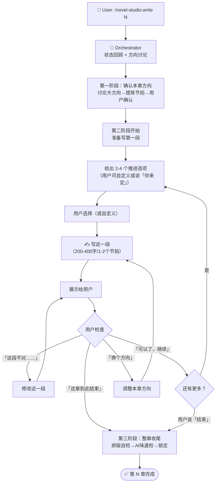

# write-chapter — 章节写作 Workflow

## 状态机



## 核心变化（与旧版对比）

| 维度 | 旧版（自动流转） | 新版（逐段协作） |
|------|----------------|----------------|
| Director | 自动生成 Story Contract | 由用户对话替代（方向讨论即 Story Contract） |
| ScenePlanner | 自动切分场景五拍 | 由用户对话替代（每段前给选项，用户选择推进方向） |
| Writer | 一次性写完整章 | 逐段写，每段 200-400 字，写完就停 |
| Critic | 写完后的全量检查 | 收尾阶段的轻量排版/格式检查 |
| 用户参与 | 仅方向选择时参与 | 每段都参与——选方向、检查、纠偏 |

## 详细步骤

### 第一阶段：确认本章方向（3-5 轮对话）

```
1. Orchestrator 报告当前故事状态：
   - 上一章发生了什么
   - 主角处境
   - 活跃伏笔
   - 读者最关心的问题
   - 章尾情绪

2. 基于故事状态给出 2-3 个本章方向选项：
   - 每个选项包含一句话方向 + 简要说明
   - 用户选择方向（或自定义任何想要的方向）
   - 选项要差异化——自然推进、借助伏笔、意外走向等不同角度

3. 提炼为本章大纲：
   - [本章方向：一句话]
   - [节拍 1] → [节拍 2] → [节拍 3] → [章尾落点]
   - 预估字数 + 分段数

4. 用户确认方向（或调整）。
   确认后，不启动自动流水线——直接进入逐段写作。
```

### 第二阶段：逐段写作（核心流程，每段重复）

```
每段流程（5 步循环）：

STEP 1 — 给出选项：
  - 基于本章方向、当前进度、活跃伏笔，给出 2-4 个推进选项
  - 选项要具体——不是「继续推进剧情」，而是「写他发现血迹后追踪到后门」
  - 第一段选项：从哪切入（接上章/场景切换/状态描写/事件直入）
  - 后续段选项：基于当前场景 + 下一节拍的自然推进方向

STEP 2 — 用户选择：
  - 用户选 A/B/C/D，或自己描述想要的方向
  - 用户说「你来定」→ 按大方向选最合适的选项
  - 用户纠偏 → 修改当前段后重新给选项
  - 用户说「结束」→ 进入第三阶段

STEP 3 — 写作：
  - Writer 写这一段（200-400 字，1-2 个场景节拍）
  - 写完就停，不往下写
  - 保持排版规范（每句≤30字，每段≤3句，系统文字用【】包裹）

STEP 4 — 展示：
  - 展示刚写的段落
  - 标注这是第几段（第 N 章 · 第 X 段）

STEP 5 — 用户检查：
  - 用户认可 → 回到 STEP 1，给出下一段选项
  - 用户纠偏 → 修改当前段 → 重新展示
  - 用户换方向 → 更新本章方向 → 回到 STEP 1 给新选项
  - 用户结束 → 「这章到此结束」→ 进入第三阶段
```

### 第三阶段：整章收尾

```
用户说「可以了」「结束」后：

1. 整章拼接，统计字数
2. 快速自检：
   - 排版：超30字句？超3句段？系统文字用【】？对话一人一段？
   - AI味：感到/觉得/仿佛/在这一刻 等关键词
   - 对话标签：是否有多余的「XX说」
   - 章尾：是否在事件半途强行切断？是否出现没头没尾的句子？→ 如果是，往前找一个自然停顿点作为章尾
3. 如有问题，列出建议让用户确认是否修复
4. 用户确认 → 锁定章节 → 更新状态
```

## 上下文管理

逐段写作模式下，上下文持续增长。每写完一段：
- 保留：本章方向 + 已写的全部段落 + 用户纠偏记录
- 不需要保留：中间过程的废稿（用户说「不对」后被替换的段落）

## 断点恢复

如果写作中断（用户离开/异常）：
- 进度 = 已确认的最新段落
- 重新 `/novel-studio:write N` 时，先展示已写内容
- 从最后一个已确认段落的下一段继续

## 反模式（禁止）

- 用户确认方向后一次性写完整章
- 每段超过 500 字（小段才能精确控制）
- 用户说「继续」就全自动跑完剩下的所有段落
- 用户说「不对」但没给方向就自己猜着改
- 跨过用户确认抢跑写下一段
- 不给选项直接让用户空想——选项降低决策成本，自定义保留灵活性
- 强行制造章尾钩子——钩子须从情节自然生长，为断章而反转/悬念造成阅读割裂
- 在事件半途强行切断——按字数（~2000）找自然停顿点收束，不在对话/打斗/揭示的高潮处戛然而止
